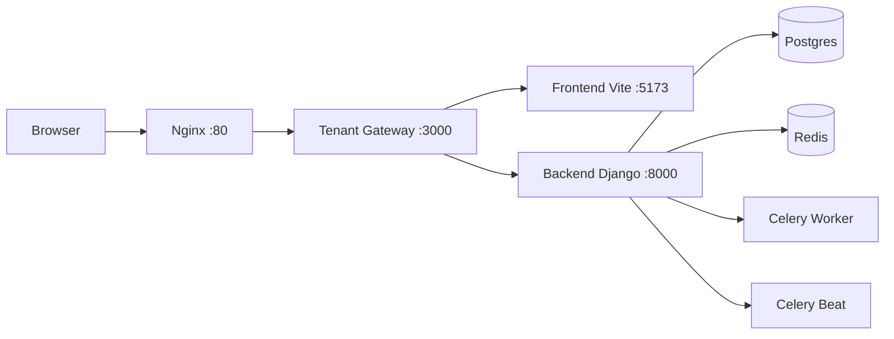

# NexUS

<p align="center">
  
</p>

<div align="center">

<p>
  
  
  
  
</p>

<p>
  <strong>Plataforma integral de gestion y convivencia para residencias universitarias</strong>
</p>

</div>

---

**Proyecto:** NexUS  
**Grupo:** 7 - NexUS  
**Asignatura:** Ingenieria del Software y Practica Profesional (ISPP)  
**Institucion:** ETSII - Universidad de Sevilla  
**Curso academico:** 2025/2026

<p align="center">
  
</p>

---

## Funcionalidades

Desde el panel de administracion se gestionan habitaciones, ocupacion, incidencias, reservas de espacios y objetos, menus del comedor y comunicados. Los estudiantes pueden reportar incidencias, hacer reservas y recibir notificaciones desde la app.

El sistema de matching basado en IA empareja a estudiantes por compatibilidad y hace seguimiento continuo del clima de convivencia. Para grupos con varias residencias, Vista NexUS ofrece un panel centralizado de control.

## Por que NexUS

NexUS esta enfocado en residencias de tamano medio (100-400 camas) con capacidades diferenciales: matching con seguimiento de convivencia, transparencia bidireccional en incidencias, reserva de objetos, analiticas de bienestar, control de visitas por QR, white-label, gestion de comedor y panel multi-residencia.

## Stack tecnico

| Capa | Tecnologias | Descripcion |
|---|---|---|
| Frontend | React, TypeScript, Vite, React Router | Interfaz web cliente (sin SSR) y enrutado en cliente |
| Backend | Django 5, django-tenants | API multitenant con aislamiento por esquema |
| Base de datos | PostgreSQL 16 + pgvector | Persistencia relacional y soporte vectorial |
| Asincronia | Redis + Celery | Cola de tareas y procesos en segundo plano |
| Infraestructura | Docker Compose + Nginx + tenant_gateway | Orquestacion local, reverse proxy e inyeccion de tenant context |

## Desarrollo rapido

Arranque base para desarrollo:

```bash
docker compose up -d
```

### Prerequisitos minimos

1. Tener `.env` (copiado desde `.env.local.example`).
2. Configurar tenant por entorno (sin tocar hosts):
   - `TENANT_CONTEXT_HOST=demo.nexus.local`
   - `DEMO_TENANT_DOMAIN=demo.nexus.local`
   - si `TENANT_CONTEXT_HOST` no existe, se usa `DEMO_TENANT_DOMAIN`
3. Primera vez recomendable: `docker compose up -d --build`.

Comando recomendado:

```bash
cp .env.local.example .env
```

### Flujo HTTP actual



Flujo operativo del proyecto:

1. Navegador -> `nginx:80`
2. Nginx -> `tenant_gateway:3000`
3. `tenant_gateway` -> frontend para HTML + consulta a backend para inyectar tenant context
4. Frontend (cliente) -> `/api` -> `tenant_gateway` -> `backend:8000`

Nota: el frontend es cliente (sin SSR). El `tenant_gateway` no renderiza React en servidor; solo inyecta contexto tenant en el HTML de entrada.

Entrada recomendada:

- `http://localhost`
- `http://demo.nexus.local` (opcional, solo si configuras `hosts`)

No usar `http://localhost:5173` como entrada principal.

### API, tenancy y decisiones arquitectonicas

Decisiones aplicadas en esta base:

1. API por mismo origen: `VITE_API_URL=/api` para evitar CORS innecesario y simplificar entornos.
2. `tenant_gateway` como capa intermedia para inyectar contexto tenant en el HTML inicial.
   - Si hay branding, inyecta `favicon_url` y `custom_css` en el `<head>`.
3. Tenant configurable por entorno: `TENANT_CONTEXT_HOST` (si no existe, se usa `DEMO_TENANT_DOMAIN`).
4. Resolucion multitenant por cabecera `Host` en backend (`django-tenants`).
5. `frontend:5173` como puerto interno del stack, no endpoint publico.
6. `"/admin"` no se proxifica porque Django Admin esta deshabilitado.

Reglas de routing del gateway:

- `"/api"` y `"/api/*"` -> backend
- `"/health/"` -> backend
- resto de rutas -> frontend

### Por que no otra arquitectura ahora

No es que otras opciones sean imposibles; en el estado actual del proyecto generan mas coste o inconsistencia:

1. Entrar por `localhost:5173` rompe el punto de control unico y no replica el flujo real por proxy.
2. Quitar `tenant_gateway` obliga a mover la inyeccion tenant/branding al cliente, con peor primer render.
3. Usar URL absoluta de backend en frontend aumenta friccion (CORS, cookies y configuracion por entorno).
4. Hardcodear un dominio tenant limita pruebas multitenant y white-label.

## Validacion realizada en desarrollo

Se levanto el stack y se valido:

- `GET /` por Nginx responde `200`.
- `GET /api/public/tenant-context/` por `http://localhost` responde `200` usando el tenant configurado en `TENANT_CONTEXT_HOST`.
- Login admin y estudiante demo responden `200`.

## Seed demo automatico al arrancar backend

En desarrollo (`SEED_DEMO_ON_STARTUP=1`) se crea automaticamente:

- Tenant: `demo.nexus.local`
- Admin: `admin@demo.nexus.local / demo1234`
- Estudiante: `estudiante@demo.nexus.local / demo1234`

## Nota sobre autoreload del backend

- El backend usa `runserver` con volumen `./backend:/app`.
- Al cambiar codigo Python, Django recarga automaticamente.
- No se recrea el contenedor por cada cambio.
- Migraciones y seed corren al arrancar backend, no en cada guardado.

## Produccion

Se incluye `docker-compose.prod.yml`.

Arranque:

```bash
docker compose -f docker-compose.prod.yml up -d --build
```

Variables recomendadas para prod:

```bash
cp .env.prod.example .env
```

Detalles de produccion:

- Backend con `gunicorn` y `config.settings.production`.
- Seed demo desactivado (`SEED_DEMO_ON_STARTUP=0`).
- Frontend cliente en modo `production` (`npm run build` + `npm run preview`).
- Nginx expuesto en `:80`.

## Documentacion

Toda la documentacion del proyecto se mantiene en `docs/`.
- Setup base y arquitectura local: `docs/setup/7-DP-Base-Setup-Docker-Compose.md`.
- Guia de desarrollo (backend, frontend, tenants y auth): `docs/setup/7-DP-Developer-Guide.md`.
- Setup inicial de SonarQube/SonarCloud: `docs/setup/7-DP-SonarQube-Initial-Setup.md`.
- Guia de analisis Sonar para el equipo: `docs/setup/7-DP-Sonar-Analysis-Guide.md`.

## Golden Flow (Git + CI/CD)

Se implementaron workflows base en `.github/workflows/`:

- `ci.yml`: checks de backend, frontend y validacion de compose.
- `sonar.yml`: analisis de calidad en SonarCloud y Quality Gate en PR hacia `main`.
- `pr-title.yml`: obliga Conventional Commits en titulo de PR.
- `release-please.yml`: prepara release PR sobre `develop`.
- `promote-tag.yml`: workflow manual para crear tags de promocion.
- `tagged-release.yml`: pipeline por tag (`dev-v*`, `stg-v*`, `pre-v*`, `v*`) y publicacion en GHCR.

Ramas recomendadas:

- `main` -> produccion
- `develop` -> staging
- `sprint/*` -> desarrollo por sprint
- `release/*` -> pre-produccion
- `hotfix/*` -> fixes urgentes desde prod

Tags por entorno:

- `dev-vX.Y.Z`
- `stg-vX.Y.Z`
- `pre-vX.Y.Z`
- `vX.Y.Z`

### Configuracion manual necesaria en GitHub

1. Activar branch protection en `main`, `develop`, `release/*`.
2. Exigir checks obligatorios:
   - `Backend checks`
   - `Frontend checks`
   - `Docker Compose validate`
   - `Validate conventional PR title`
3. Desactivar push directo a ramas protegidas.
4. Configurar `RELEASE_PLEASE_TOKEN` (PAT con permisos de `contents` y `pull requests`) para activar `release-please`.
5. Configurar secretos opcionales de deploy webhook:
   - `DEPLOY_WEBHOOK_DEV`
   - `DEPLOY_WEBHOOK_STG`
   - `DEPLOY_WEBHOOK_PRE`
   - `DEPLOY_WEBHOOK_PROD`
