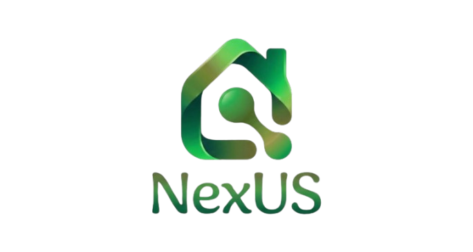

<h1>Análisis de stacks tecnológicos – NexUS</h1>

<p align="center">
  
</p>

<div align="center">

<p>
  
  
  
  
</p>

<p>
  <strong>Plataforma integral de gestión y convivencia para residencias universitarias</strong>
</p>

</div>

---

**Proyecto:** NexUS  
**Grupo:** 7 - NexUS  
**Asignatura:** Ingeniería del Software y Práctica Profesional (ISPP)  
**Institución:** ETSII – Universidad de Sevilla  
**Curso académico:** 2025/2026  
**Fecha:** 10/02/2026  

<p align="center">
  
</p>

---

Este documento presenta un análisis de la competencia y una evaluación de los posibles stacks tecnológicos para el proyecto **NexUS**. El objetivo es seleccionar un conjunto de tecnologías frontend y backend óptimo que garantice la escalabilidad, mantenibilidad y rendimiento del producto final.

---

# **1. Análisis de la competencia**

El patrón observado tras comprobar los stacks de la competencia muestra una fuerte tendencia hacia frameworks de JavaScript en el frontend aunque hay gran diversidad en el backend, siendo notable la presencia de .NET. Para llevar a cabo el análisis se han tenido en cuenta datos publicados por los propios competidores en sus respectivas webs o en foros como [stackshare](https://stackshare.io/). En algunos casos se han usado datos inferidos proporcionados por plataformas fiables como [builtwith](https://builtwith.com/).

| Competidor    | Modelo de Negocio                | Stack Tecnológico (Frontend/Backend) | Notas Relevantes                                                                                                                                                                   |
| :------------ | :------------------------------- | :----------------------------------- | :--------------------------------------------------------------------------------------------------------------------------------------------------------------------------------- |
| Entrata       | PaaS/ Suscripción B2B            | React / PHP / AWS                    | Enfoque en Plataforma como Servicio. Tiene una arquitectura orientada a microservicios que usa AWS Lambda.                                                                         |
| StarRez       | Suscripción B2B                  | React / .NET (C#) / SQL Server       | Usa Microsoft Power Automate, para mejorar el rendimiento de flujos complejos como roommate matching basado en afinidad.                                                           |
| Yardi Student | Licencia Enterprise              | Angular / .NET / SQL Server          | Destaca por su integración nativa con Power BI, permitiendo crear dashboards intuitivos a partir de datos que optimizan por ejemplo las rentas de las habitaciones en tiempo real. |
| Breezeway     | SaaS por Propiedad/Unidad        | React Native / Python                | Incluye herramientas de mensajería automatizada, inspecciones con IA para control de calidad y suministros mediante Computer Vision.                                               |
| Convivo App   | Freemium / Suscripción Community | Flutter / Node.js / Firebase         | Orientada a la experiencia del residente. Notificaciones y chat en tiempo real muy optimizados.                                                                                    |
| ResiPlus      | Suscripción Community            | React Native / .NET                  | Su arquitectura permite la generación de informes oficiales para la administración pública, ventaja en el sector sociosanitario y residencias de mayores.                          |

---

# **2. Stacks propuestos**

Estas propuestas han sido diseñadas para equilibrar la rapidez en el desarrollo del MVP con la escalabilidad necesaria para gestionar residencias de gran escala. Cada stack representa un enfoque distinto: desde la especialización en IA hasta la robustez corporativa.

> Nota clave (actualización): Para NexUS se prioriza **React con TypeScript** como estándar de frontend (con **Vite + SSR**) y se fija como solución ganadora un backend **Django** por su “baterías incluidas”, seguridad y velocidad de entrega.

| Categoría                     | A. IA-First                     | **B. Full-Stack Baterías (GANADORA)**                    | C. Tradicional Robusta       | D. Agilidad JS                       | E. Potencia Empresarial         |
| :---------------------------- | :------------------------------ | :------------------------------------------------------- | :--------------------------- | :----------------------------------- | :------------------------------ |
| **Frontend**                  | React + TypeScript (Vite + SSR) | React + TypeScript (Vite + SSR)                          | Vue.js                       | React + TypeScript (Vite + SSR)      | React + TypeScript (Vite + SSR) |
| **Gestor Dependencias Front** | npm                             | npm                                                      | npm                          | npm                                  | npm                             |
| **Librerías Front (UI/UX)**   | Tailwind + Radix UI             | Shadcn/ui + Tailwind                                     | PrimeVue                     | Flowbite + Lucide Icons              | Shadcn/ui + Tailwind            |
| **Backend**                   | Python (FastAPI)                | **Python (Django + DRF)**                                | Java (Spring Boot)           | Node.js (Express)                    | .NET 8 (C#)                     |
| **Gestor Dependencias Back**  | Poetry                          | pip / Poetry                                             | Maven                        | npm                                  | NuGet                           |
| **Base de Datos**             | PostgreSQL                      | PostgreSQL                                               | MySQL                        | PostgreSQL + Redis                   | SQL Server / Azure SQL          |
| **Lib. IA (Actas/NLP)**       | LangChain + OpenAI              | LlamaIndex/LangChain + OpenAI                            | Spring AI / LangChain4j      | OpenAI SDK (Node)                    | Semantic Kernel                 |
| **Testing (F/B)**             | Jest / Pytest                   | RTL / Pytest                                             | Playwright / Vitest          | Vitest                               | Playwright / xUnit              |
| **Despliegue (F/B/DB)**       | Vercel / Railway / Supabase     | **Cloudflare Pages / Azure App Service / Supabase**      | Railway / Clever Cloud       | Vercel / Fly.io / Supabase + Upstash | Azure App Service               |
| **Multi-tenant**              | DB-Level (Logical Schemas)      | **App-Level (django-tenants)**                           | App-Level (Hibernate Filter) | DB-Level (RLS + Redis tenant-prefix) | DB-Level (SQL Server RLS)       |
| **RBAC**                      | Custom JWT + Decorators         | **Django Auth + DRF Permissions**                        | Spring Security              | Middleware custom                    | ASP.NET Identity + Policies     |
| **Auditoría**                 | Logging estructurado            | **Django Auditlog + Admin**                              | Spring Data Envers           | Winston + Cloud logs                 | EF Audit + Serilog              |
| **RGPD**                      | Field-Level Enc. (Fernet)       | **Field-level encryption + políticas + trazabilidad**    | Spring Crypto (AES-GCM)      | Field-level Encryption (GCM)         | SQL Always Encrypted            |
| **Inmutabilidad**             | Append-only tables              | **Model versioning + append-only en entidades críticas** | JPA Immutable cols           | Append-only + JSONB hashing          | Azure SQL Ledger                |

---

## **Análisis de Alternativas**

### **A. Alternativa IA-First (FastAPI + React TypeScript)**

* **Enfoque:** maximizar rendimiento y flexibilidad para el motor de IA.
* **Pros:** latencia baja, muy adecuada para endpoints orientados a E/S y servicios asíncronos.
* **Contras:** muchas piezas críticas (admin, permisos, auditoría, gestión de usuarios) requieren montaje manual.

### **B. Alternativa Full-Stack Baterías (Django + React TypeScript) — GANADORA**

* **Enfoque:** prioriza seguridad, mantenibilidad y velocidad de entrega del MVP con un core robusto.
* **Pros:**

  * Django Admin acelera la operativa interna (gestión de usuarios, incidencias, contratos, reglas).
  * Modelo de permisos maduro (Django Auth + DRF Permissions) para RBAC granular.
  * Ecosistema ideal para IA/documentos (Python) y para colas de trabajo (Celery/RQ).
  * Frontend escalable con React + TypeScript y renderizado SSR con Vite para mejorar TTFB, SEO y experiencia percibida.
* **Contras:**

  * Django puede sentirse más estructurado que micro-frameworks.
  * El multi-tenant y permisos avanzados requieren diseño (pero con librerías como django-tenants se reduce el riesgo).

### **C. Alternativa Tradicional Robusta (Spring Boot + Vue)**

* **Enfoque:** estabilidad empresarial y transacciones críticas.
* **Pros:** seguridad muy madura y consistencia transaccional fuerte.
* **Contras:** más fricción para IA en comparación con Python; mayor verbosidad.

### **D. Alternativa Agilidad JS (Node.js + React TypeScript)**

* **Enfoque:** unificar stack en TypeScript end-to-end.
* **Pros:** velocidad de iteración y E/S eficiente.
* **Contras:** mayor disciplina necesaria en arquitectura, aislamiento multi-tenant (RLS), y consistencia de reglas de negocio complejas.

### **E. Alternativa Potencia Empresarial (.NET + React TypeScript)**

* **Enfoque:** escalabilidad vertical y seguridad de grado enterprise.
* **Pros:** rendimiento alto y ecosistema corporativo potente.
* **Contras:** coste y lock-in (frecuentemente Azure) si no se controla; más peso en desarrollo para el MVP.

---

# **3. Pros y Contras de las Tecnologías Propuestas**

## **3.1. Tecnologías Frontend**

### **Opción: React + TypeScript (Vite + SSR como estándar)**

| Pros                                                                                      | Contras                                                                             |
| :---------------------------------------------------------------------------------------- | :---------------------------------------------------------------------------------- |
| Ecosistema enorme y contratación sencilla.                                                | Requiere decidir librerías (routing/estado) y buenas convenciones.                  |
| TypeScript reduce errores y define “contratos” claros entre pantallas y API.              | Si no se gobierna bien, los tipos pueden crecer en complejidad.                     |
| SSR con Vite mejora el tiempo hasta primer render y la indexabilidad de páginas públicas. | SSR introduce complejidad (hydration, caché, despliegue) si no se parametriza bien. |
| Escalable (lazy loading, patrones de composición, testing sólido).                        |                                                                                     |

## **3.2. Tecnologías Backend (contexto)**

Se mantienen las opciones comparadas (Node, Python, .NET), pero la recomendación final se fija en Django.

### **Opción recomendada: Python (Django + DRF)**

| Pros                                                  | Contras                                                           |
| :---------------------------------------------------- | :---------------------------------------------------------------- |
| Velocidad de entrega (batteries included).            | Necesita buena configuración ASGI/Workers para alta concurrencia. |
| Seguridad y autenticación maduras.                    | Si no se diseña bien, el monolito puede crecer desordenado.       |
| Perfecto para integraciones IA y pipeline documental. |                                                                   |

---

# **4. Desafíos tecnológicos y estrategias de mitigación**

## **4.1. El reto de la IA: ¿Cómo ahorrar en "Tokens"?**

* **Solución (RAG):** chunks + embeddings en PostgreSQL con pgvector.
* **Trazabilidad:** Hash SHA-256 por archivo para evitar reindexado innecesario.
* **Persistencia:** vectores + resumen + versión de modelo + fecha de indexación para auditoría técnica.

## **4.2. Almacenamiento eficiente y seguridad de datos sensibles**

* **Object Storage:** Supabase Storage / S3 / Cloudflare R2.
* **URLs firmadas:** acceso temporal bajo demanda.
* **Políticas de acceso:** validación en backend (Django/DRF) + reglas de negocio.

## **4.3. Procesamiento asíncrono (Queue + Workers)**

* **API (Django/DRF):** recibe archivo, lo guarda y devuelve un task_id.
* **Cola:** Redis (broker) en plan free/low-cost.
* **Workers:** Celery (o Django-RQ) procesa OCR/thumbnails/chunking/embeddings/resumen.
* **Tiempo real:** Django Channels (WebSockets) para actualizar estado en frontend.

---

# **5. Recomendación preliminar**

Tras el análisis detallado de los stacks y la evaluación de las capacidades del equipo, se determina que la alternativa ganadora para NexUS es la **Alternativa B: React + TypeScript (Vite + SSR) en frontend, y Django + DRF en backend**.

## **5.1. Justificación de la elección técnica**

* **Django como base estable para el MVP y escalado:**
  Reduce riesgo por incluir autenticación, administración, ORM, validaciones y un ecosistema probado para permisos y auditoría. Acelera módulos críticos: residentes, roles, incidencias, contratos, habitaciones, facturación.

* **IA y pipeline documental integrados de forma natural en Python:**
  Integración directa con librerías de NLP/RAG. El trabajo pesado se externaliza a workers con Celery, evitando bloqueos y timeouts.

* **React + TypeScript con Vite + SSR como estándar de interfaz:**
  TypeScript actúa como contrato API/UI y reduce bugs. SSR con Vite mejora rendimiento percibido (TTFB/First Paint) e indexación en páginas públicas (marketing, accesos informativos), manteniendo una base de código moderna.

* **Menor riesgo arquitectónico que “todo custom”:**
  Frente a stacks donde hay que montar permisos, admin, auditoría y multi-tenant desde cero, Django reduce superficie de fallo y permite concentrarse en el producto.

## **5.2. Estrategia de infraestructura y despliegue (Coste Cero/Bajo)**

| Componente                       | Proveedor Seleccionado           | Modelo de Coste                |
| :------------------------------- | :------------------------------- | :----------------------------- |
| Backend (Django + DRF)           | Azure App Service                | Créditos Azure for Students    |
| Frontend (React TS + Vite SSR)   | Cloudflare Pages                 | Gratis                         |
| Archivos (Contratos/Incidencias) | Cloudflare R2                    | Gratis (hasta ciertos límites) |
| Base de datos                    | Supabase (PostgreSQL + pgvector) | Gratis (Shared Instance)       |
| Cola de tareas                   | Upstash Redis                    | Gratis (Serverless Tier)       |
| Workers                          | App Service / Fly.io / Railway   | Bajo coste / créditos          |

## **5.3. Matriz de decisión de stacks (Scores)**

| Criterio de Evaluación     | A. IA-First | **B. Full-Stack (GANADORA)** | C. Tradicional | D. Agilidad JS | E. Potencia Ent. |
| :------------------------- | :---------: | :--------------------------: | :------------: | :------------: | :--------------: |
| Velocidad de Desarrollo    |      3      |             **5**            |        2       |        5       |         3        |
| Curva de Aprendizaje       |      3      |             **4**            |        2       |        5       |         1        |
| Integración de IA          |      5      |             **5**            |        3       |        4       |         4        |
| Integración Diseño (Figma) |      2      |             **5**            |        2       |        5       |         3        |
| Consistencia de Datos      |      4      |             **5**            |        5       |        4       |         5        |
| **TOTAL SCORE**            |    **17**   |            **24**            |     **14**     |     **23**     |      **16**      |

## **5.4. Conclusión estratégica**

La **Opción B** se consolida como la ganadora con **24 puntos**. Esta elección maximiza la velocidad de entrega del MVP sin sacrificar seguridad ni mantenibilidad, y encaja especialmente bien con los retos del proyecto: multi-tenant, RBAC, auditoría, gestión documental y pipeline de IA con procesamiento asíncrono.

# **6. Control de versiones y estrategia de releases**

## **6.1. Adopción de Golden Git Flow**

NexUS implementará **Golden Git Flow**, una metodología de control de versiones de alta higiene que establece una separación clara entre entornos mediante el uso de ramas específicas y tags como mecanismo de despliegue.

### **Estructura de ramas y entornos**

El proyecto contará con cuatro tipos de ramas principales, cada una asociada a un entorno específico:

* **Ramas sprint** (formato: `sprint/*`): Representan el desarrollo activo durante cada sprint. Todo el trabajo de nuevas features se integra aquí primero. Estas ramas despliegan automáticamente al entorno de **desarrollo (dev)**, donde los desarrolladores pueden probar sus cambios de forma temprana.

* **Rama develop**: Actúa como rama de integración continua. Cuando un sprint finaliza, su contenido se fusiona a develop. Esta rama despliega al entorno de **staging (stg)**, donde se realizan pruebas de integración más exhaustivas con datos similares a producción.

* **Ramas release** (formato: `release/*`): Se crean desde develop cuando se prepara una nueva versión para producción. En estas ramas se realizan las últimas correcciones y ajustes de QA sin añadir nuevas funcionalidades. Despliegan al entorno de **pre-producción (pre)**, réplica exacta de producción para validación final.

* **Rama master**: Contiene únicamente código que está o ha estado en producción. Es la rama más estable del proyecto y despliega al entorno de **producción (prod)**.

### **Flujo de promoción de código**

El código progresa de forma unidireccional a través de las ramas siguiendo este orden:

```
sprint/* → develop → release/* → master
   (dev)     (stg)      (pre)      (prod)
```

Esta progresión garantiza que cada cambio pase por todos los niveles de testing antes de llegar a producción, reduciendo significativamente el riesgo de bugs en el entorno productivo.

### **Despliegues controlados mediante tags**

A diferencia de otros flujos donde el despliegue se activa automáticamente con cada push, Golden Git Flow utiliza **tags** como "órdenes de despliegue". Esto significa que el equipo decide explícitamente cuándo realizar un despliegue creando un tag en la rama correspondiente.

**Ventajas de este enfoque:**

* **Control deliberado:** Los despliegues no ocurren accidentalmente. Alguien debe crear conscientemente el tag para disparar el deployment.
* **Trazabilidad completa:** Cada versión desplegada tiene un tag asociado, lo que permite saber exactamente qué código está corriendo en cada entorno.
* **Reversibilidad sencilla:** Si algo falla, volver a una versión anterior es tan simple como redesplegar desde el tag de la versión funcional anterior.
* **Auditoría:** Todos los despliegues quedan registrados en el historial de tags del repositorio.

## **6.2. Versionado semántico automatizado**

### **Implementación de SemVer (Semantic Versioning)**

El proyecto adoptará el estándar de versionado semántico con formato `MAJOR.MINOR.PATCH`:

* **MAJOR** (X.0.0): Se incrementa cuando hay cambios que rompen la compatibilidad hacia atrás. Por ejemplo, cambios en la estructura de la API que requieren que los clientes actualicen su código, o modificaciones en el modelo de datos que requieren migraciones especiales.

* **MINOR** (0.Y.0): Se incrementa cuando se añade nueva funcionalidad de forma compatible. Por ejemplo, añadir un nuevo endpoint REST, agregar una nueva feature en la UI, o implementar un nuevo módulo del sistema.

* **PATCH** (0.0.Z): Se incrementa para correcciones de bugs que no cambian funcionalidad. Por ejemplo, arreglar un error de validación, corregir un bug visual, o mejorar el rendimiento de una consulta existente.

### **Conventional Commits para automatización**

Para automatizar el cálculo de versiones, el equipo utilizará **Conventional Commits**, un estándar que estructura los mensajes de commit de forma que herramientas automáticas puedan determinar el tipo de cambio realizado.

**Formato de commits:**

* **fix:** Indica una corrección de bug. Ejemplo: `fix: corregir validación de email en formulario de registro`. Este tipo de commit incrementará el número PATCH.

* **feat:** Indica una nueva funcionalidad. Ejemplo: `feat: añadir filtro de búsqueda avanzada en dashboard`. Este tipo de commit incrementará el número MINOR.

* **feat!** o **fix!:** El símbolo de exclamación indica un cambio que rompe compatibilidad. También se puede incluir `BREAKING CHANGE:` en el footer del commit. Estos commits incrementan el número MAJOR.

**Casos especiales:**

* Cuando hay múltiples commits en una PR, se aplica la regla del "mayor impacto": si hay un commit MAJOR, la versión sube MAJOR aunque haya también commits MINOR o PATCH.

* En el flujo de trabajo con squash merge (fusión de commits), el título de la Pull Request se convierte en el único mensaje de commit que queda en el historial. Por tanto, es crítico que los títulos de PR sigan el formato Conventional Commits.

* Para evitar errores, se implementará validación automática de títulos de PR mediante GitHub Actions, rechazando PRs cuyos títulos no cumplan el formato.

### **Herramienta Release Please**

Se utilizará **Release Please**, una herramienta desarrollada por Google que automatiza completamente el proceso de versionado:

**Funcionamiento:**

1. Release Please analiza todos los commits nuevos en la rama develop desde la última versión.
2. Determina el tipo de bump (major/minor/patch) basándose en los prefijos de Conventional Commits.
3. Crea automáticamente una **Release PR** (Pull Request de release) que incluye:
   - El nuevo número de versión calculado
   - Un CHANGELOG actualizado con todos los cambios
   - Actualización de archivos de versión en el proyecto
4. Cuando el equipo aprueba y fusiona esta Release PR, Release Please crea automáticamente un tag en GitHub con la nueva versión.

**Configuración para monorepo:**

Dado que NexUS es un monorepo (frontend y backend en el mismo repositorio), se configurará Release Please para mantener una única versión sincronizada en tres lugares:

* Un archivo `version.txt` en la raíz del proyecto, que será la fuente de verdad.
* El campo `version` en `frontend/package.json` para el frontend.
* El campo `version` en `backend/pyproject.toml` para el backend Python.

Esta sincronización evita desajustes de versiones entre componentes y simplifica la gestión de releases.

## **6.3. Convenciones de tags y despliegues**

### **Tags canónicos de versión**

El tag principal de cada release seguirá el formato `vX.Y.Z`. Por ejemplo: `v1.4.0`, `v2.0.0`, `v1.4.1`.

Este tag se crea en la rama master cuando el código llega a producción, y representa la versión "oficial" del sistema.

### **Tags de promoción por entorno**

Para facilitar el tracking de qué versión está en cada entorno, se utilizarán tags con prefijos de entorno:

| Entorno    | Patrón de tag | Ejemplo      | Rama base   |
| :--------- | :------------ | :----------- | :---------- |
| Desarrollo | `dev-vX.Y.Z`  | `dev-v1.4.0` | `sprint/*`  |
| Staging    | `stg-vX.Y.Z`  | `stg-v1.4.0` | `develop`   |
| Pre-prod   | `pre-vX.Y.Z`  | `pre-v1.4.0` | `release/*` |
| Producción | `vX.Y.Z`      | `v1.4.0`     | `master`    |

**Creación de tags:**

Los tags no se crean manualmente. En su lugar, se implementará un workflow manual de GitHub Actions llamado "Promote to Environment" que:

* Lee la versión actual del archivo `version.txt`
* Crea el tag apropiado según el entorno seleccionado
* Apunta el tag al HEAD de la rama correspondiente
* Pushea el tag al repositorio, lo que automáticamente dispara el despliegue

Este proceso manual garantiza que los despliegues sean deliberados pero evita errores humanos en la creación de tags.

### **Enforcement de convenciones**

Para garantizar que el sistema de versionado funcione correctamente, se implementarán dos controles automáticos:

1. **Validación de títulos de PR:** Un GitHub Action validará que todos los títulos de Pull Request sigan el formato Conventional Commits antes de permitir la fusión. Si el título no cumple el formato, la PR se bloqueará hasta que se corrija.

2. **Definición clara de BREAKING CHANGES:** El equipo documentará qué tipos de cambios se consideran breaking (cambios en APIs públicas, modificaciones de esquema de base de datos que requieren migraciones especiales, cambios en contratos de integración con terceros). Esto evitará incrementos de versión MAJOR accidentales y garantizará que se incrementen cuando sea realmente necesario.

---

# **7. Estrategia de contenedorización con Docker**

## **7.1. Enfoque de arquitectura containerizada**

NexUS adoptará **Docker** como tecnología de contenedorización para empaquetar y ejecutar todos los componentes del sistema. Esta decisión se fundamenta en tres pilares:

### **Consistencia entre entornos**

El problema clásico de "en mi máquina funciona" desaparece con Docker. El mismo contenedor que un desarrollador ejecuta en su laptop es idéntico al que corre en los servidores de staging y producción. Esto elimina bugs causados por diferencias en versiones de dependencias, configuraciones del sistema operativo, o variables de entorno.

### **Portabilidad entre proveedores cloud**

Aunque inicialmente el despliegue se realizará en Azure (aprovechando créditos de Azure for Students), la arquitectura containerizada permite migrar a cualquier proveedor (AWS, GCP, DigitalOcean, etc.) con mínimas modificaciones. Los contenedores son agnósticos al proveedor de infraestructura.

### **Versionado sincronizado con el código**

Cada tag de versión de código generará imágenes Docker con ese mismo tag. Por ejemplo, cuando se crea el tag `v1.4.0`, se construirán automáticamente:
* `ghcr.io/nexus/nexus-backend:v1.4.0`
* `ghcr.io/nexus/nexus-worker:v1.4.0`
* `ghcr.io/nexus/nexus-frontend-ssr:v1.4.0`

Esto permite rollbacks instantáneos simplemente cambiando qué versión de imagen está corriendo en cada entorno.

## **7.2. Componentes contenedorizados**

El sistema se dividirá en tres contenedores principales:

### **Backend (Django + DRF con ASGI)**

**Propósito:** Servir la API REST con Django REST Framework. Correrá bajo Uvicorn, un servidor ASGI de alto rendimiento, en lugar del tradicional Gunicorn WSGI. Esto permite aprovechar las capacidades asíncronas de Django 4.x+ y Django Channels para websockets.

**Características clave:**
* Expone el puerto 8000
* Incluye Django Admin para gestión interna
* Se configura con múltiples workers de Uvicorn para aprovechar múltiples cores
* Ejecuta collectstatic durante el build para servir archivos estáticos de Admin/DRF

**Registry:** Las imágenes se alojarán en GitHub Container Registry (GHCR), que es gratuito para repositorios públicos y tiene integración nativa con GitHub Actions.

### **Worker (Celery para procesamiento asíncrono)**

**Propósito:** Ejecutar tareas en segundo plano como procesamiento de documentos con OCR, generación de embeddings para RAG, envío de emails, y generación de reportes pesados.

**Arquitectura:** Utilizará la **misma imagen base que el backend** (Django + DRF), pero con un comando de inicio diferente. En lugar de arrancar Uvicorn, ejecutará `celery worker`. Esto evita duplicar el código y las dependencias, simplificando el mantenimiento.

**Configuración:**
* Se conecta a Redis como broker de mensajes (configurado en Upstash Redis para plan gratuito)
* Se configura con concurrencia de 4 workers por defecto (ajustable según carga)
* Consume tareas de la misma cola Redis a la que el backend Django envía trabajos

**Nota importante:** Al ser la misma imagen, cualquier actualización de dependencias o del código Django se refleja automáticamente en ambos servicios (API y workers), manteniendo la sincronización perfecta.

### **Frontend SSR (React + TypeScript + Vite)**

**Propósito:** Servir la aplicación React con Server-Side Rendering para mejorar el rendimiento percibido (Time To First Byte, First Contentful Paint) y la indexabilidad SEO de páginas públicas.

**Arquitectura de build:**
* **Stage 1 (Build):** Compila el código TypeScript y genera los bundles optimizados con Vite. Instala todas las dependencias (incluidas las de desarrollo).
* **Stage 2 (Runtime):** Copia solo los artefactos compilados y las dependencias de producción a una imagen limpia. Esto reduce el tamaño final de la imagen en un 60-70%.

**Configuración:**
* Expone el puerto 3000
* Corre sobre Node.js 20 (versión LTS con mejor rendimiento)
* Usa Alpine Linux como base para minimizar el footprint (la imagen final pesa ~150MB vs ~800MB sin Alpine)
* El entry point SSR renderiza React en el servidor y envía HTML hidratado al cliente

## **7.3. Convenciones de nombrado y tagging de imágenes**

### **Nombres de imágenes**

Las imágenes seguirán el patrón `ghcr.io/<organización>/nexus-<componente>`:
* `ghcr.io/nexus-team/nexus-backend`
* `ghcr.io/nexus-team/nexus-worker`
* `ghcr.io/nexus-team/nexus-frontend-ssr`

### **Tags de versión**

Cada imagen se etiquetará con múltiples tags simultáneamente:

**Tag principal (SemVer):**
* `v1.4.0` - El tag canónico de la versión
* `dev-v1.4.0`, `stg-v1.4.0`, `pre-v1.4.0` - Tags de entorno con la versión

**Tags flotantes (opcionales):**
* `latest` - Apunta siempre a la última versión estable en producción
* `dev`, `stg`, `pre`, `prod` - Tags que se actualizan para apuntar a la última versión desplegada en cada entorno

**Tags de debugging (opcionales):**
* `sha-a3f5c2d` - Tag basado en el commit hash corto para builds de prueba o investigación de bugs específicos

Esta estrategia de multi-tagging permite flexibilidad: en producción se puede apuntar a un tag específico como `v1.4.0` para máxima estabilidad, mientras que en desarrollo se puede usar el tag flotante `dev` que siempre obtiene la última versión.

## **7.4. Entorno de desarrollo local**

Para el desarrollo local se utilizará **Docker Compose**, que orquestará todos los servicios necesarios:

**Servicios incluidos:**

1. **PostgreSQL 16:** Base de datos principal con extensión pgvector para embeddings de IA. Los datos se persisten en un volume Docker para no perderlos entre reinicios.

2. **Redis 7:** Broker de mensajes para Celery. Corre en memoria (sin persistencia) ya que las tareas son efímeras.

3. **Backend:** El servicio Django corriendo en modo desarrollo con auto-reload. Los cambios en el código se reflejan inmediatamente sin necesidad de rebuild.

4. **Worker:** El servicio Celery también con auto-reload para desarrollo ágil de tareas asíncronas.

5. **Frontend:** El servidor de desarrollo de Vite con hot module replacement. Los cambios en React se actualizan instantáneamente en el navegador.

**Configuración de desarrollo:**

* Todos los servicios montan el código fuente como volumes, permitiendo desarrollo sin rebuild constante
* Las variables de entorno se configuran para desarrollo (DEBUG=True, logging verboso)
* El frontend se configura para apuntar a `localhost:8000` para la API
* Los puertos se exponen al host para acceso directo: 3000 (frontend), 8000 (backend), 5432 (postgres), 6379 (redis)

**Ventajas:**

* Un desarrollador nuevo puede levantar el stack completo con un solo comando
* Todos los desarrolladores trabajan con exactamente las mismas versiones de servicios
* Se pueden probar flujos completos (frontend → backend → worker → base de datos) en local antes de subir código

---

# **8. Pipeline de CI/CD (Integración y Despliegue Continuos)**

## **8.1. Arquitectura general del pipeline**

El pipeline de CI/CD de NexUS se estructura en tres fases principales que garantizan la calidad del código antes de llegar a producción:

### **Fase 1: Validación continua (CI)**

Esta fase se ejecuta automáticamente en cada Push y Pull Request. Su objetivo es detectar problemas lo antes posible:

* **Ejecución de tests:** Tanto frontend (tests unitarios con Vitest, tests de componentes con React Testing Library) como backend (tests unitarios y de integración con Pytest) se ejecutan en paralelo.

* **Análisis estático:** Se verifica que el código cumple los estándares de calidad mediante linters (ESLint para frontend, Ruff para backend) y type checking (TypeScript para frontend, MyPy para backend).

* **Validación de commits:** Se verifica que los títulos de Pull Request sigan el formato Conventional Commits, bloqueando la fusión si no cumplen.

* **Reporte de cobertura:** Se calcula y reporta la cobertura de tests, con integración a Codecov para tracking histórico.

* **Quality Gate en PR:** Se ejecuta análisis de calidad en SonarCloud para Pull Requests contra `main`, bloqueando merges cuando no se cumplan las condiciones del Quality Gate en código nuevo (cobertura, duplicación, seguridad, fiabilidad y mantenibilidad).

#### **Implementación actual de Sonar en NexUS**

La integración se apoya en los siguientes artefactos del repositorio:

* `sonar-project.properties`: definición de fuentes (`backend`, `frontend`), exclusiones y rutas de cobertura (`backend/coverage.xml`, `frontend/coverage/lcov.info`).
* `.github/workflows/sonar.yml`: workflow de GitHub Actions para análisis en SonarCloud en cada PR a `main`.
* `run-sonar.sh`: ejecución local "zero-install" del scanner mediante Docker.
* `docker-compose.sonarqube.yml`: stack local de SonarQube Community + PostgreSQL dedicado para pruebas/ajuste del gate.

#### **Configuración requerida en GitHub**

En `Settings -> Secrets and variables -> Actions`:

* **Secret:** `SONAR_TOKEN`
* **Variables:** `SONAR_PROJECT_KEY`, `SONAR_ORGANIZATION`

Sin esta configuración, el job de SonarCloud no podrá autenticar ni resolver proyecto/organización.

### **Fase 2: Construcción de artefactos**

Esta fase se dispara únicamente cuando se crea un tag de versión (dev-v*, stg-v*, pre-v*, v*):

* **Build de imágenes Docker:** Se construyen las tres imágenes (backend, worker, frontend-ssr) utilizando Docker Buildx para aprovechar caché y acelerar builds.

* **Optimización de build:** Se utiliza caché de GitHub Actions para reutilizar layers de Docker entre builds, reduciendo el tiempo de construcción de ~10 minutos a ~3 minutos en builds incrementales.

* **Publicación a registry:** Las imágenes se publican en GitHub Container Registry con los tags apropiados (tanto el tag de versión como los tags flotantes).

* **Escaneo de seguridad:** Cada imagen se escanea con Trivy para detectar vulnerabilidades conocidas en dependencias. Los resultados se publican en GitHub Security Dashboard.

### **Fase 3: Despliegue automático**

Esta fase se ejecuta inmediatamente después del build exitoso, desplegando automáticamente a los entornos según el tipo de tag:

* **Tag dev-v*:** Despliega a entorno de desarrollo
* **Tag stg-v*:** Despliega a entorno de staging
* **Tag pre-v*:** Despliega a entorno de pre-producción
* **Tag v* (sin prefijo):** Despliega a producción

Cada despliegue incluye:
* Autenticación con el proveedor cloud (Azure)
* Pull de las imágenes Docker desde GHCR
* Actualización del servicio con la nueva versión
* Verificación de health checks antes de dar el despliegue como exitoso
