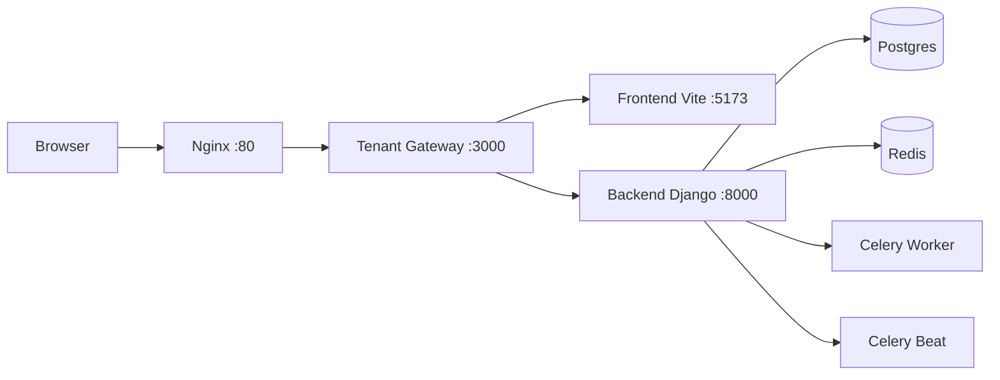

# 7-DP Base Setup (Docker Compose + Nginx + Multitenant)

## Objetivo
Este documento explica como levantar el proyecto base en local, cual es el flujo real de peticiones y por que se han tomado las decisiones arquitectonicas actuales.

Punto clave: el frontend es cliente (no SSR). Existe un servicio intermedio (`tenant_gateway`) que inyecta contexto tenant y branding en el HTML antes de entregarlo al navegador.

## 1) Prerrequisitos
- Docker Desktop (o Docker Engine + Docker Compose v2)
- Git
- Archivo `.env` en la raiz del proyecto

## 2) Preparar entorno local
1. Copiar variables de entorno de desarrollo:

```bash
cp .env.local.example .env
```

En PowerShell:

```powershell
Copy-Item .env.local.example .env
```

2. Definir tenant por entorno (sin tocar `hosts`):

```env
TENANT_CONTEXT_HOST=demo.nexus.local
DEMO_TENANT_DOMAIN=demo.nexus.local
```

`TENANT_CONTEXT_HOST` indica que dominio tenant usara `tenant_gateway` cuando accedes por `http://localhost`.
Si no lo defines, se usa `DEMO_TENANT_DOMAIN`.

3. (Opcional) Anadir dominio al archivo `hosts` solo si quieres abrir ese dominio directamente en el navegador:

```text
127.0.0.1 demo.nexus.local
```

En Windows, editar como administrador: `C:\Windows\System32\drivers\etc\hosts`.

## 3) Arranque base del proyecto
Primera ejecucion:

```bash
docker compose up -d --build
```

Siguientes ejecuciones:

```bash
docker compose up -d
```

Servicios levantados:
- `postgres` (PostgreSQL + pgvector)
- `redis`
- `backend` (Django + migraciones + seed demo opcional)
- `celery_worker`
- `celery_beat`
- `frontend` (Vite, cliente)
- `tenant_gateway` (inyeccion de contexto tenant + proxy API)
- `nginx` (reverse proxy de entrada)

## 4) Diagrama de arquitectura y flujo


### Flujo de carga de pagina (`GET /`)
1. Browser llama `http://localhost/`.
2. Nginx hace `proxy_pass` a `tenant_gateway:3000`.
3. `tenant_gateway` pide HTML base al frontend (`frontend:5173`).
4. `tenant_gateway` consulta `/api/public/tenant-context/` al backend con `Host` tenant correcto.
5. `tenant_gateway` inyecta en `<head>`:
- `window.__NEXUS_DATA__` con `tenantContext`
- `favicon_url` como `<link rel="icon" ...>` si existe
- `custom_css` como `<style id="tenant-custom-css">...</style>` si existe
6. Browser recibe HTML final y monta app cliente.

### Flujo de API (`/api/*`)
1. Frontend hace `fetch('/api/...')`.
2. Nginx -> `tenant_gateway`.
3. `tenant_gateway` detecta `/api` o `/api/*` y proxifica a `backend:8000`.
4. Backend responde y vuelve por el mismo camino.

Nota: `"/admin"` no se proxifica porque Django Admin esta deshabilitado.

## 5) Decisiones arquitectonicas tomadas (y alternativas descartadas)
| Decision | Elegido | Alternativa descartada | Por que no en este proyecto |
|---|---|---|---|
| Punto de entrada unico web | Nginx `:80` | Entrar a `:5173` directo | Rompe el flujo unificado de proxy/inyeccion y complica multitenant por `Host` |
| Capa intermedia para tenant | `tenant_gateway` | Frontend directo a backend sin gateway | No puedes inyectar contexto/branding en HTML antes del arranque de la app |
| API por mismo origen | `VITE_API_URL=/api` | URL absoluta a backend (`http://backend:8000` o dominio API) | Aumenta friccion (CORS, cookies, configuraciones por entorno) |
| Resolucion tenant configurable | `TENANT_CONTEXT_HOST` (fallback `DEMO_TENANT_DOMAIN`) | Dominio hardcodeado (`demo.nexus.local`) | No escalable ni flexible para mas tenants/entornos |
| Inyeccion branding en `<head>` | En `tenant_gateway` (servidor) | Cargar branding solo en cliente tras mount | Parpadeo visual, favicon tardio y primer render sin contexto tenant consistente |
| Frontend sin SSR | App cliente Vite + gateway | Migrar a SSR completo ahora | Incrementa complejidad y no es necesario para el objetivo actual |
| Rutas backend publicadas por gateway | `/api`, `/health/` | Exponer backend directo al browser | Se pierde control central de cabeceras y politica de acceso |
| Stack completo local | Docker Compose | Servicios mezclados host+docker | Menos reproducible y mas "works on my machine" |
| `hosts` obligatorio | No (opcional) | Forzarlo siempre | Introduce friccion; con `TENANT_CONTEXT_HOST` ya funciona por `localhost` |

## 6) Por que "no hacerlo de otra manera" en este contexto
No es que tecnicamente sea imposible con otras arquitecturas; es que, con las reglas actuales del proyecto (multitenant por dominio + branding inyectado + entrada unica), las alternativas generan mas coste o inconsistencias:

1. Entrar por `localhost:5173` evita el punto de control central y no garantiza el mismo comportamiento que produccion.
2. Quitar `tenant_gateway` obliga a mover inyeccion de contexto al cliente, con riesgo de estados iniciales incorrectos (tenant/theme) y UX inconsistente.
3. Llamar backend directo desde frontend incrementa friccion (CORS/cookies/hosts) y dispersa reglas de red entre componentes.
4. Hardcodear dominio tenant acopla desarrollo a un unico tenant y dificulta pruebas reales de white-label.

## 7) Validacion rapida tras el arranque
1. Comprobar contenedores:

```bash
docker compose ps
```

2. Abrir en navegador:
- `http://localhost`
- `http://demo.nexus.local` (opcional, solo para pruebas multitenant por dominio)

3. Validar contexto tenant por flujo normal:

```bash
curl http://localhost/api/public/tenant-context/
```

4. (Opcional) Validar host explicito de dominio:

```bash
curl -H "Host: demo.nexus.local" http://localhost/api/public/tenant-context/
```

Debe devolver `200` con datos del tenant esperado.

## 8) Credenciales demo (si `SEED_DEMO_ON_STARTUP=1`)
- Admin: `admin@demo.nexus.local / demo1234`
- Estudiante: `estudiante@demo.nexus.local / demo1234`

## 9) Troubleshooting rapido
- Si `demo.nexus.local` no responde, revisar `hosts`.
- Si backend no arranca:

```bash
docker compose logs backend --tail=200
```

- Si falla entrada web:

```bash
docker compose logs nginx --tail=200
docker compose logs tenant_gateway --tail=200
docker compose logs frontend --tail=200
```
