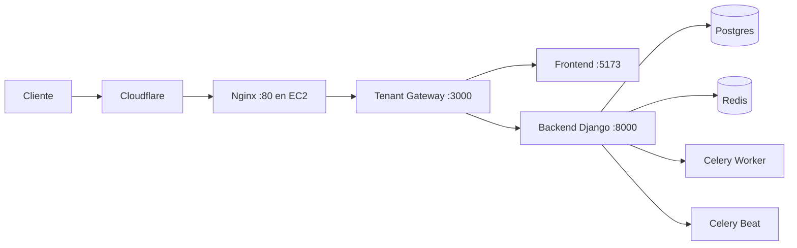

## Deploy on Cloud - NexUS

<p align="center">
  
</p>

<div align="center">

<p>
  
  
  
  
</p>

<p>
  <strong>Plataforma integral de gestion y convivencia para residencias universitarias</strong>
</p>

</div>

---

**Proyecto:** NexUS  
**Grupo:** 7 - NexUS  
**Asignatura:** Ingenieria del Software y Practica Profesional (ISPP)  
**Institucion:** ETSII - Universidad de Sevilla  
**Curso academico:** 2025/2026  
**Fecha:** 04/03/2026

<p align="center">
  
</p>

---

## Historial de Versiones

| Version | Fecha      | Cambio principal |
|---------|------------|------------------|
| 1.0.0   | 04/03/2026 | Creacion de la guia de despliegue cloud en AWS + Cloudflare |

---

## Indice

- [1. Arquitectura objetivo](#1-arquitectura-objetivo)
- [2. Requisitos previos](#2-requisitos-previos)
- [3. Preparar EC2 (Ubuntu)](#3-preparar-ec2-ubuntu)
  - [3.1 Security Group (minimo)](#31-security-group-minimo)
  - [3.2 Instalar Docker y Compose](#32-instalar-docker-y-compose)
- [4. Clonar y configurar proyecto](#4-clonar-y-configurar-proyecto)
- [5. Login en GHCR y despliegue](#5-login-en-ghcr-y-despliegue)
- [6. DNS + SSL en Cloudflare (sin exponer IP en DNS)](#6-dns--ssl-en-cloudflare-sin-exponer-ip-en-dns)
  - [6.1 DNS](#61-dns)
  - [6.2 SSL](#62-ssl)
- [7. Endurecimiento para ocultar el origen (recomendado)](#7-endurecimiento-para-ocultar-el-origen-recomendado)
  - [7.1 Bloquear acceso directo por IP en Nginx](#71-bloquear-acceso-directo-por-ip-en-nginx)
- [8. Crear tenant y usuarios de prueba](#8-crear-tenant-y-usuarios-de-prueba)
- [9. Verificaciones post-despliegue](#9-verificaciones-post-despliegue)
- [10. Troubleshooting rapido](#10-troubleshooting-rapido)

---

## 1. Arquitectura objetivo

Esta guia describe el despliegue de NexUS en AWS usando imagenes Docker publicadas en GHCR y dominio gestionado por Cloudflare.

Flujo de trafico:

`Cliente -> Cloudflare (DNS proxied + SSL) -> Nginx (EC2) -> tenant-gateway -> frontend/backend`

Servicios levantados por `docker-compose.prod.images.yml`:

- `postgres` (pgvector)
- `redis`
- `backend` (Django + gunicorn)
- `celery_worker`
- `celery_beat`
- `frontend` (Vite preview)
- `tenant_gateway`
- `nginx`



## 2. Requisitos previos

- Cuenta AWS con permisos para crear una EC2.
- Dominio gestionado en Cloudflare.
- Acceso al repo `ispp-g7-nexus/7-NexUS`.
- Docker y Docker Compose plugin instalables en la VM.
- Si GHCR es privado, un token con `read:packages`.

## 3. Preparar EC2 (Ubuntu)

Recomendado para entorno pequeno/medio:

- 2 vCPU
- 4 GB RAM
- 80 GB SSD

### 3.1 Security Group (minimo)

- `22/tcp` solo desde tu IP de administracion.
- `80/tcp` abierto.

### 3.2 Instalar Docker y Compose

```bash
sudo apt update
sudo apt install -y ca-certificates curl gnupg
sudo install -m 0755 -d /etc/apt/keyrings
curl -fsSL https://download.docker.com/linux/ubuntu/gpg | sudo gpg --dearmor -o /etc/apt/keyrings/docker.gpg
echo \
  "deb [arch=$(dpkg --print-architecture) signed-by=/etc/apt/keyrings/docker.gpg] https://download.docker.com/linux/ubuntu \
  $(. /etc/os-release && echo $VERSION_CODENAME) stable" | \
  sudo tee /etc/apt/sources.list.d/docker.list > /dev/null
sudo apt update
sudo apt install -y docker-ce docker-ce-cli containerd.io docker-buildx-plugin docker-compose-plugin
sudo usermod -aG docker $USER
newgrp docker
docker --version
docker compose version
```

## 4. Clonar y configurar proyecto

```bash
git clone https://github.com/ispp-g7-nexus/7-NexUS.git
cd 7-NexUS
cp .env.prod.example .env.prod
```

Edita `.env.prod` con valores reales, minimo:

- `DJANGO_SECRET_KEY`
- `JWT_SIGNING_KEY`
- `DJANGO_ALLOWED_HOSTS` (ej: `sprint1.nbynexus.com`)
- `DJANGO_CSRF_TRUSTED_ORIGINS` (ej: `https://sprint1.nbynexus.com`)
- `TENANT_CONTEXT_HOST` (ej: `sprint1.nbynexus.com`)
- credenciales de PostgreSQL

## 5. Login en GHCR y despliegue

```bash
sudo docker login ghcr.io
export GHCR_OWNER=ispp-g7-nexus
export IMAGE_TAG=v0.3.1   # o dev/stg/pre/prod/sha-<commit>
sudo --preserve-env=GHCR_OWNER,IMAGE_TAG docker compose -f docker-compose.prod.images.yml pull
sudo --preserve-env=GHCR_OWNER,IMAGE_TAG docker compose -f docker-compose.prod.images.yml up -d --force-recreate
sudo --preserve-env=GHCR_OWNER,IMAGE_TAG docker compose -f docker-compose.prod.images.yml ps
```

Logs utiles:

```bash
sudo docker compose -f docker-compose.prod.images.yml logs -f backend
sudo docker compose -f docker-compose.prod.images.yml logs -f celery_worker
sudo docker compose -f docker-compose.prod.images.yml logs -f nginx
```

## 6. DNS + SSL en Cloudflare

### 6.1 DNS

En Cloudflare DNS:

- Tipo: `A`
- Nombre: `sprint1` (o el subdominio que uses)
- Contenido: IP publica de EC2
- `Proxy status`: **Proxied** (nube naranja)

Con esto, el cliente ve IP de Cloudflare, no la IP real en respuesta DNS.

### 6.2 SSL

Con la configuracion actual (Nginx expone `:80`), usa:

- `SSL/TLS mode`: `Flexible`
- `Always Use HTTPS`: ON

## 7. Endurecimiento para ocultar el origen

Solo Cloudflare proxied no es suficiente: la IP origen puede seguir siendo accesible por acceso directo.

### 7.1 Bloquear acceso directo por IP en Nginx

En `nginx/default.conf`, dentro de `server { ... }`, puedes anadir:

```nginx
if ($host ~* "^[0-9.]+$") { return 444; }
```


## 8. Crear tenant y usuarios de prueba

Tras levantar contenedores, crea tenant demo:

```bash
sudo --preserve-env=GHCR_OWNER,IMAGE_TAG docker compose -f docker-compose.prod.images.yml exec backend \
python manage.py seed_demo \
  --domain sprint1.nbynexus.com \
  --schema sprint1 \
  --tenant-slug sprint1 \
  --tenant-name Sprint1 \
  --admin-email admin@sprint1.nbynexus.com \
  --student-email estudiante@sprint1.nbynexus.com \
  --student2-email estudiante2@sprint1.nbynexus.com \
  --password demo1234
```

## 9. Verificaciones post-despliegue

1. `curl -I http://127.0.0.1` dentro de la VM responde `200/301`.
2. `https://sprint1.nbynexus.com` carga frontend.
3. Login con usuario demo responde `200`.
4. `docker compose ... ps` sin servicios reiniciando continuamente.

## 10. Troubleshooting rapido

- `permission denied /var/run/docker.sock`:
  - anadir usuario al grupo `docker` y reabrir sesion.
- `404 /api/public/tenant-context/`:
  - dominio/tenant no creado en DB, ejecutar `seed_demo`.
- `Received unregistered task matching.*`:
  - imagen de `celery_worker` desalineada o servicio sin reiniciar.
- `ghcr.io/... not found`:
  - el tag no existe en GHCR o el workflow de tag no publico esa imagen.
