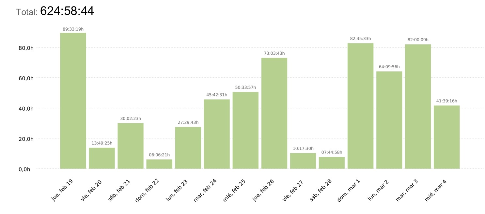

<h1>Gráfico de tareas con métricas de calidad - NexUS</h1>

  

  
  
  
  

  <strong>Plataforma integral de gestión y convivencia para residencias universitarias</strong>

---

**Proyecto:** NexUS  
**Grupo:** 7 - NexUS  
**Asignatura:** Ingeniería del Software y Práctica Profesional (ISPP)  
**Institución:** ETSII – Universidad de Sevilla  
**Curso académico:** 2025/2026  
**Fecha:** 04/03/2026  

  

---

## Historial de Versiones

| Versión | Fecha | Cambio principal |
|---------|-------|------------------|
| 1.0.0 | 04/03/2026 | Creación del documento base |
---

## ÍNDICE

- [1. Resumen Ejecutivo](#1-resumen-ejecutivo)
- [2. Métricas de tiempo (Clockify)](#2-métricas-de-tiempo-clockify)
- [3. Medición de tareas](#3-medición-de-tareas)
- [4. Calidad y gestión de coordinadores](#4-calidad-y-gestión-de-coordinadores)
    - [4.1 Indicador clave de desempeño](#41-indicador-clave-de-desempeño)
    - [4.2 Calidad de código y proceso](#42-calidad-de-código-y-proceso)
- [5. Calidad Técnica y del Código](#5-calidad-técnica-y-del-código)
    - [5.1 Legibilidad y mantenibilidad](#51-legibilidad-y-mantenibilidad)
    - [5.2 Coherencia Visual](#52-coherencia-visual)
- [6. Estabilidad y Seguridad](#6-estabilidad-y-seguridad)
- [7. Protocolo de Seguimiento y Mejora](#7-protocolo-de-seguimiento-y-mejora)

---

## 1. Resumen Ejecutivo

El Sprint 1 ha tenido como foco principal la consolidación de los cimientos tecnológicos de NexUS. Durante este periodo, el equipo se ha centrado en establecer una arquitectura robusta y escalable que permita el desarrollo fluido de las funcionalidades de gestión de residencias. El balance global es positivo, habiendo logrado una integración exitosa entre el núcleo de datos y las interfaces de usuario iniciales.

Los objetivos específicos alcanzados han sido:
- **Infraestructura técnica**: Configuración funcional de entornos (Docker, WSL2) y repositorios.
- **Seguridad**: Implementación de la autenticación y gestión básica de usuarios.
- **Administración**: Despliegue de un panel administrativo operativo para la gestión centralizada.
- **Core de Negocio**: Desarrollo del sistema básico de reporte y visualización de incidencias.
- **Estándares de Calidad**: Definición de la base común de UX/UI (Tailwind) y protocolos de testing (SonarCloud).
- **Despliegue**: Puesta en marcha de la aplicación en la nube (entorno de staging/producción).

## 2. Métricas de tiempo (Clockify)

  

## 3. Medición de tareas

Evaluamos qué parte del Product Backlog se ha transformado realmente en incremento de software.

- **Total issues planificadas**: 84
- **Total issues completadas**: 82
- **Desviación técnica**: 97,62%
- **Calidad de las revisiones (Code Review)**: Las revisiones de las PRs se están haciendo correctamente, poniendo comentarios negativos cuando algo esté mal o incompleto, y con comentarios positivos cuando todo funcione correctamente.

## 4. Calidad y gestión de coordinadores

En esta sección evaluamos el desempeño de los coordinadores en cuanto a la comunicación con sus equipos, la distribución de tareas y la organización del flujo de trabajo. Asimismo, se analiza su sincronización con el resto de los coordinadores para la gestión del Product Backlog.

Tras realizar un formulario de evaluación sobre la gestión de los coordinadores, Scrum Master y Product Owner, los resultados muestran que el 100% de los integrantes considera que se está realizando una gestión óptima del Sprint.

## 5. Calidad Técnica y del Código

Este apartado es importante para demostrar que el proyecto es sostenible y profesional.

### 5.1 Legibilidad y Mantenibilidad

Se ha priorizado la escritura de Clean Code y una arquitectura de archivos organizada por funcionalidades. Esto reduce la curva de aprendizaje para nuevos desarrolladores y facilita la expansión del sistema.

- **Evidencia Técnica**: El análisis automático de SonarCloud otorga una calificación de A en mantenibilidad.
- **Deuda Técnica**: Se ha mantenido un nivel de "Code Smells" bajo Completar.
- **Estandarización**: Uso de TypeScript para evitar errores de tipado y mejorar el autocompletado del código.

### 5.2 Principales Logros

Para garantizar una experiencia de usuario uniforme y profesional se ha implementado un Sistema de Diseño centralizado mediante Tailwind CSS.

-  **Identidad Corporativa**: Uso unificado del color principal y misma tipografía en todos los módulos.
- **Reutilización de Componentes**: Las tarjetas de incidencias, botones y modales comparten las mismas clases de espaciado y sombras, eliminando discrepancias visuales entre la vista de Administrador y Estudiante.
- **Adaptabilidad**: Diseño Responsive, asegurando que la interfaz sea coherente tanto en dispositivos móviles como en escritorio.

## 6. Estabilidad y Seguridad

La robustez de NexUS se ha garantizado mediante un control riguroso de fallos críticos, apoyado en el análisis estático de SonarCloud, lo que asegura que las funcionalidades entregadas en este Sprint operen sin interrupciones técnicas ni errores de ejecución.

En el ámbito de la seguridad, se ha implementado un sistema sólido de gestión de roles y privacidad basado en protocolos de autenticación y autorización. Se ha verificado exhaustivamente que cada perfil de usuario (estudiante y administrador) acceda exclusivamente a la información y herramientas que le corresponden según su nivel de permisos. Este control no solo protege la integridad de los datos sensibles de la residencia, sino que previene de forma efectiva cualquier intento de acceso no autorizado a las áreas de gestión administrativa.

## 7. Protocolo de Seguimiento y Mejora

Para garantizar la evolución constante del proyecto NexUS, se ha establecido un protocolo de seguimiento basado en la automatización y la reflexión estratégica del equipo. Mediante la implementación de herramientas de control automático e integración continua (CI), como SonarCloud, cada incremento de código es analizado en tiempo real, permitiendo detectar de forma proactiva posibles fallos técnicos o inconsistencias antes de su integración final.

Complementariamente, el SM ha realizado el Sprint Review y Sprint Retrospective al cierre del ciclo, esto ha sido fundamental en el Sprint 1 para identificar cuellos de botella y para ajustar los flujos de comunicación interna. Este enfoque de mejora continua asegura que las lecciones aprendidas se transformen en acciones concretas, optimizando la capacidad de respuesta y el desarrollo de tareas para los próximos Sprint del proyecto.
