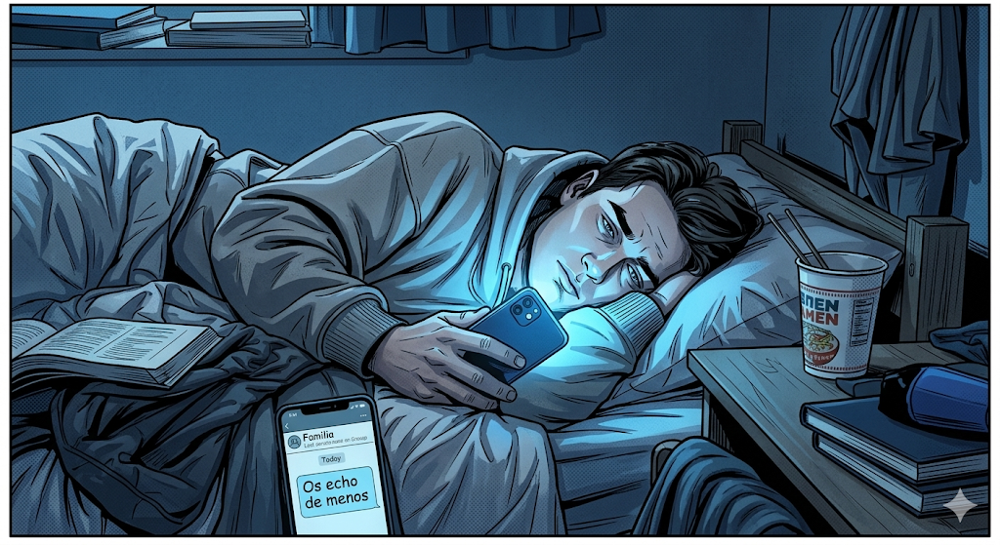
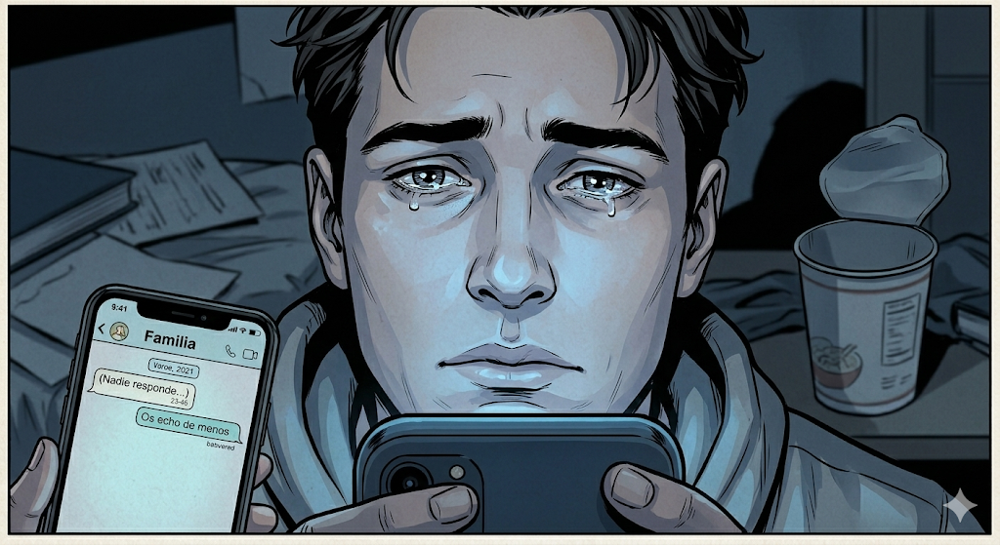
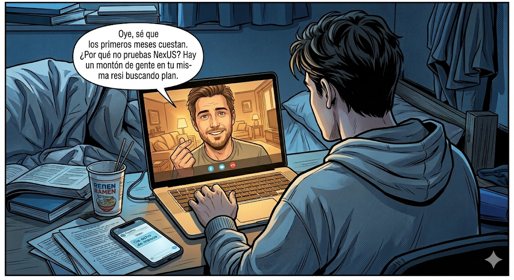
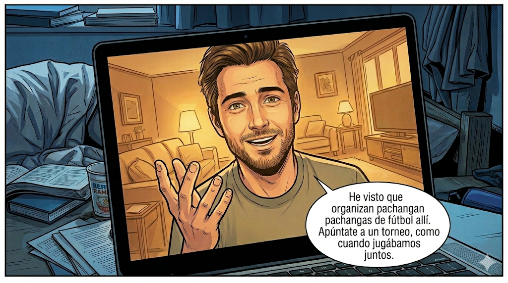
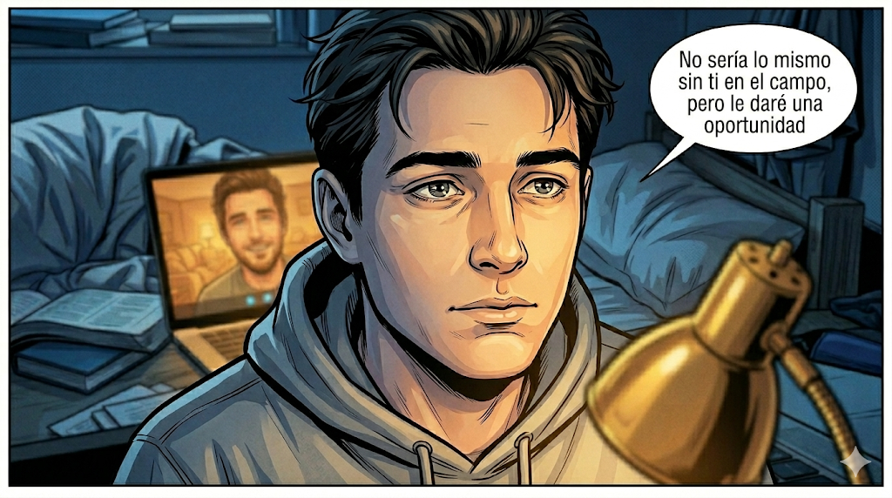
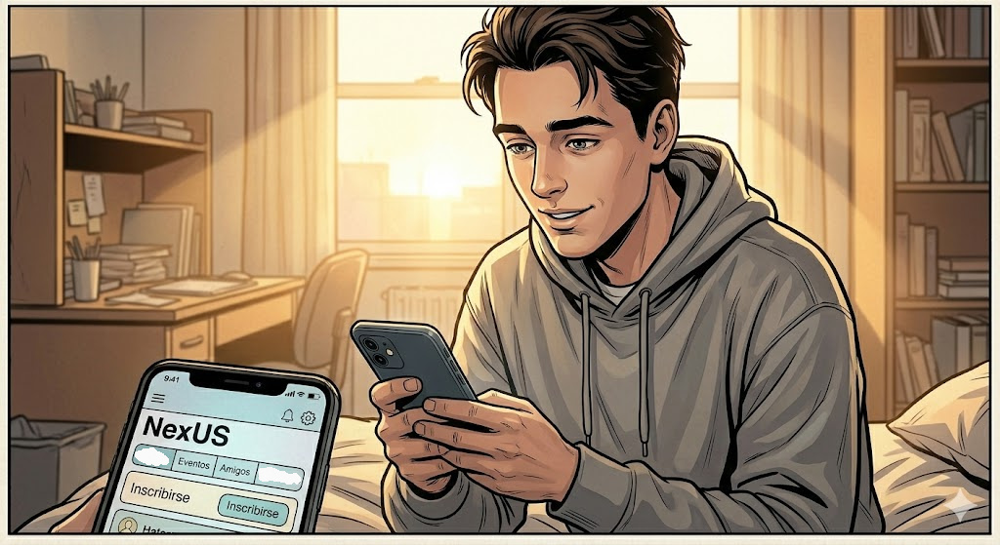
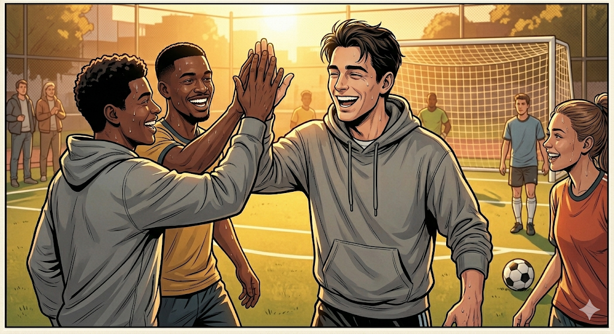
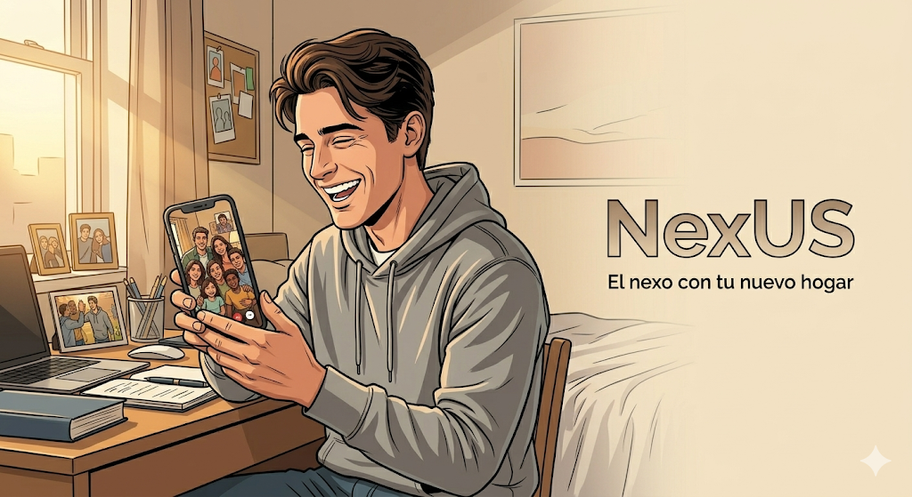

# Storyboard de Anuncio

	

	
	
	
	

	<strong>Plataforma integral de gestión y convivencia para residencias universitarias</strong>

---

**Proyecto:** NexUS  
**Grupo:** 7 - NexUS  
**Asignatura:** Ingeniería del Software y Práctica Profesional (ISPP)  
**Institución:** ETSII – Universidad de Sevilla  
**Curso académico:** 2025/2026  
**Fecha:** 15/04/2026  

	

---

## 1. Descripción general de la pieza

Este storyboard define un anuncio emocional de NexUS centrado en un estudiante que atraviesa un periodo de soledad al inicio de su vida en residencia universitaria. La narrativa muestra una evolución clara: del aislamiento y la nostalgia hacia la reconexión social y familiar gracias a la app.

La historia se construye en ocho viñetas con una progresión visual y emocional muy marcada. El punto de giro aparece cuando el hermano mayor le anima a usar NexUS para encontrar planes en su residencia y volver a practicar deportes en equipo, como hacían juntos en el pasado.

El cierre transmite el mensaje de marca: NexUS actúa como puente entre el nuevo entorno del estudiante y su hogar.

## 2. Objetivos del anuncio

1. Mostrar un problema real y reconocible para el público objetivo.
2. Presentar NexUS como una solución práctica.
3. Asociar la marca con emociones positivas: compañerismo, pertenencia y bienestar.
4. Comunicar que la aplicación no solo conecta con otras personas, sino también con la sensación de hogar.
5. Cerrar con un lema memorable y alineado con el posicionamiento de marca.

## 3. Desglose del storyboard

### Viñeta 1. El peso de la distancia

El protagonista aparece solo en su habitación, en una noche tranquila de residencia. Mira una foto familiar en el móvil y se nota que está cansado y con morriña.

### Viñeta 2. La soledad en un toque

Se centra en su reacción al chat familiar sin respuesta. Es el momento en el que se ve más claro que echa de menos su casa.

### Viñeta 3. El salvavidas

Entra la videollamada con el hermano, que le anima y le plantea probar NexUS para conocer gente en la residencia.

### Viñeta 4. El recuerdo compartido

El hermano le recuerda los partidos que jugaban y le propone apuntarse a un evento de fútbol. El protagonista empieza a cambiar de actitud.

### Viñeta 5. La chispa emocional

Momento más personal de la conversación: el hermano le habla con cariño y confianza, y se nota que el mensaje le llega.

### Viñeta 6. El paso adelante

Al día siguiente decide dar el paso: abre NexUS y busca planes. Aquí la historia pasa de la duda a la acción.

### Viñeta 7. La conexión real

Se le ve jugando fútbol con nuevos compañeros y disfrutando de verdad. La app se traduce en conexión real fuera de la pantalla.

### Viñeta 8. El nexo

Cierre del anuncio con el protagonista contento, hablando con su familia después del partido. Se cierra el anuncio con un eslogan: **"NexUS: el nexo con tu nuevo hogar."**

## 4. Mensaje final

La pieza comunica que NexUS no es una aplicación de residencias cualquiera, sino que ayuda a transformar la experiencia de los residentes, creando comunidad y haciendo que la distancia con el hogar se viva de forma más saludable. El anuncio se centrará en el aspecto social de NexUS, dejando un poco de lado el aspecto de gestión, ya que nos facilita inspirar emociones en el espectador.
