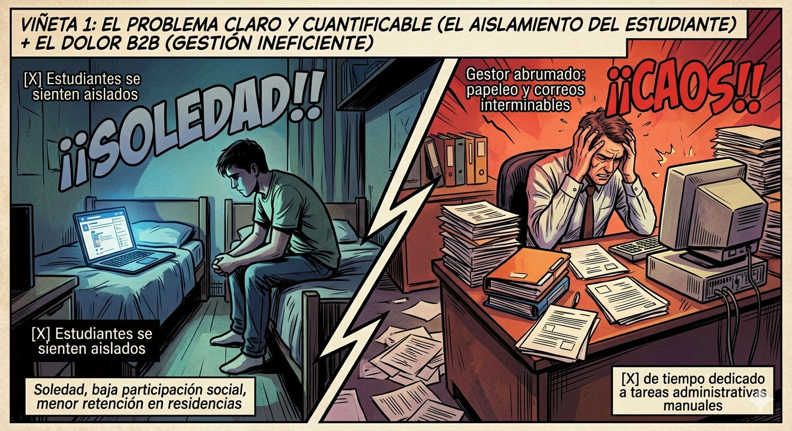
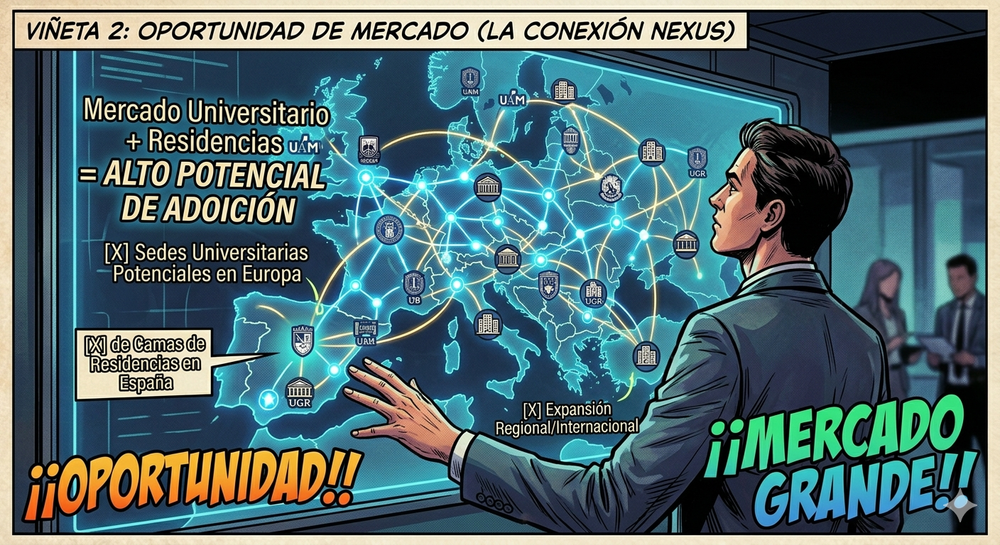
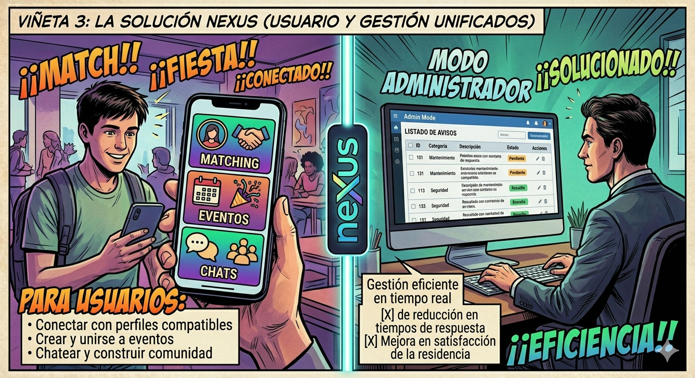
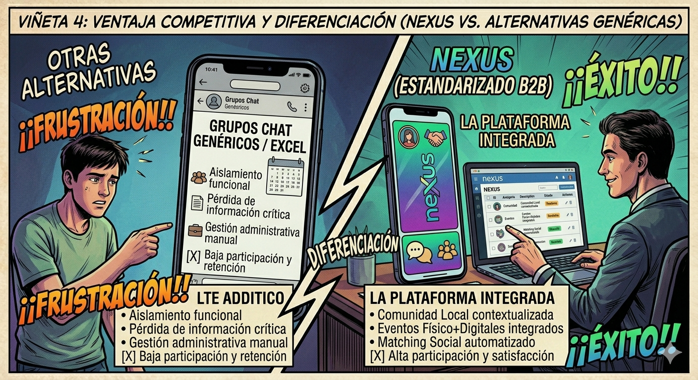
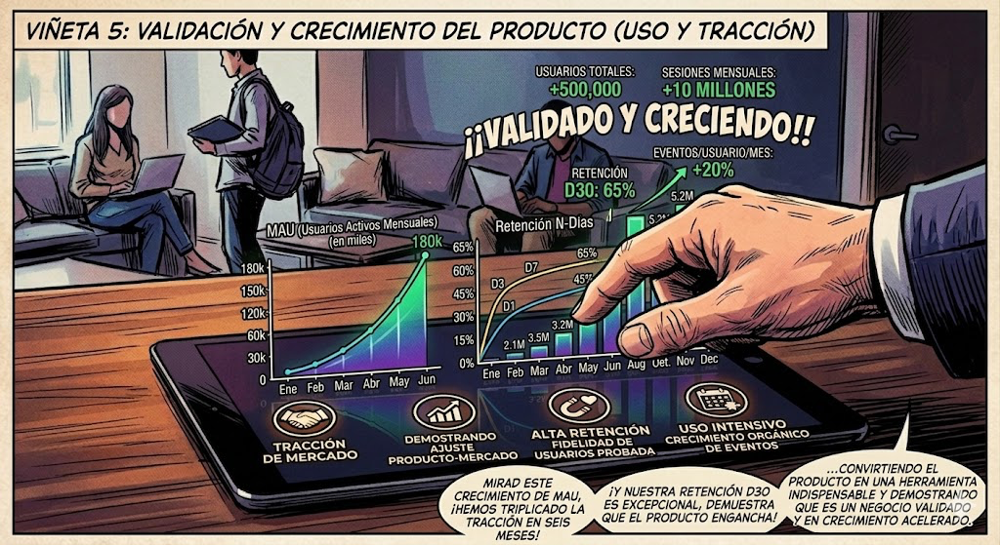
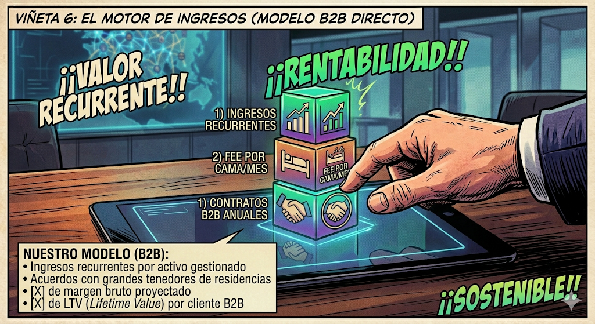
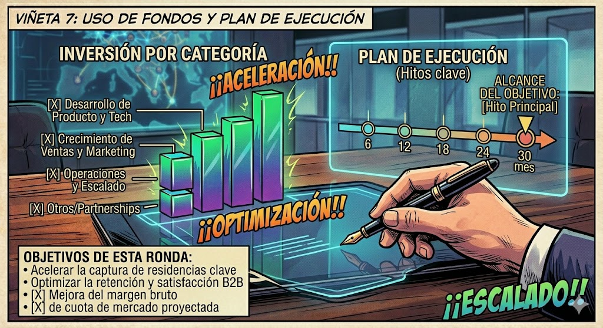
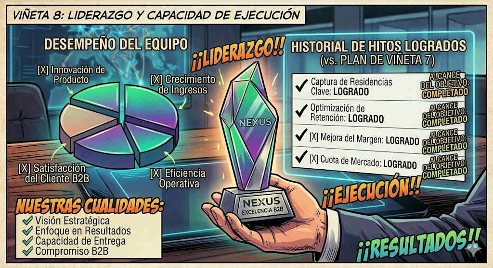
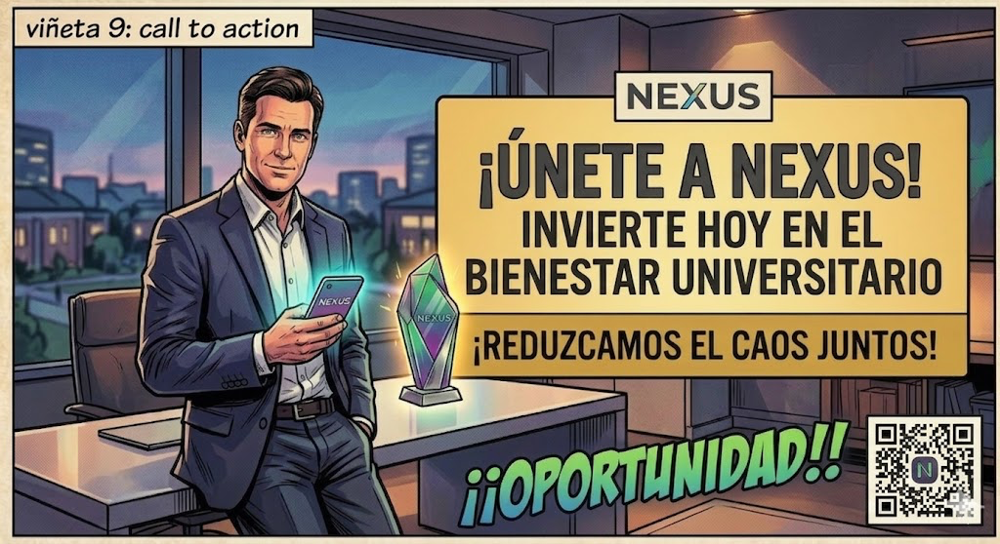

# Storyboard para Inversores

	

	
	
	
	

	<strong>Plataforma integral de gestión y convivencia para residencias universitarias</strong>

---

**Proyecto:** NexUS  
**Grupo:** 7 - NexUS  
**Asignatura:** Ingeniería del Software y Práctica Profesional (ISPP)  
**Institución:** ETSII – Universidad de Sevilla  
**Curso académico:** 2025/2026  
**Fecha:** 15/04/2026  

	

---

## 1. Descripción general de la pieza

Este storyboard define un pitch de inversión para NexUS, orientado a convencer a inversores sobre el potencial de la plataforma. La narrativa sigue una estructura comercial clara: desde la identificación del problema y la oportunidad de mercado hasta la proyección de beneficios y una llamada a la acción.

El objetivo es comunicar tanto la necesidad real en el mercado como la viabilidad comercial del modelo de negocio, apoyándose en métricas, datos y un equipo con capacidad de ejecución.

## 2. Objetivos del pitch

1. Demostrar que existe un problema real y cuantificable en el mercado de residencias.
2. Explicar la oportunidad comercial y el potencial de crecimiento.
3. Presentar NexUS como solución única y diferenciada frente a competidores.
4. Mostrar tracción inicial que valide el producto.
5. Detallar el modelo de negocio y fuentes de ingresos.
6. Proyectar retorno en inversión con timeline realista.
7. Comunicar claridad sobre el uso de fondos.
8. Transmitir confianza en el equipo ejecutor.
9. Cerrar con una propuesta de valor clara para los inversores.

## 3. Desglose del storyboard (9 viñetas)

### Viñeta 1. El problema y el mercado

Presentación del problema: baja participación social y caos organizativo en las residencias.

### Viñeta 2. Oportunidad de mercado

Mapa de España y Europa con universidades y residencias conectadas. El mensaje es claro: mercado fragmentado, alto potencial de adopción, listo para digitalización.

### Viñeta 3. La solución NexUS

Pantalla del móvil mostrando la app con funcionalidades clave tanto para residentes como para gestores de residencias. Simplicidad, valor inmediato, experiencia de usuario intuitiva.

### Viñeta 4. Diferenciación competitiva

Comparativa visual limpia de NexUS frente a alternativas. Ventajas destacadas: enfoque tanto en el residente como en la residencia, matching social, eventos, comunidad, incidencias...

### Viñeta 5. Tracción inicial

Equipo revisando métricas en pantalla. Datos visuales de usuarios activos mensuales, retención, eventos creados por mes... Demostramos que es un producto validado y en crecimiento.

### Viñeta 6. Modelo de negocio

Presentación del modelo de negocio presentando posibles ingresos y justificación mostrando acuerdos con residencias, métricas de uso...

### Viñeta 7. Beneficio para el inversor (timeline)

Línea temporal visual clara con hitos clave, como expansión a nuevas residencias, consolidación B2B e incremento de margen e incluso un posible escalado regional y optimización de rentabilidad.

### Viñeta 8. Uso de fondos

Desglose de las operaciones y áres que se fortalezerán con el dinero obtenido. Ejemplo: 40% crecimiento y ventas, 30% producto y tecnología, 20% operaciones y expansión, 10% marca y partnerships. El objetivo es que sepan cómo se va a usar el dinero que inviertan

### Viñeta 9. Llamada a la acción

Escena final con algún miembro del equipo en contexto profesional, transmitiendo competencia y visión. Incita a los inversores a apoyarnos.

## 4. Mensaje final de comunicación

Este pitch busca posicionar NexUS no como una app más de residencias, sino como una oportunidad de inversión en la transformación digital del bienestar universitario. La propuesta combina un problema real y cuantificable, una solución diferenciada, tracción inicial validada y un modelo de negocio escalable.
