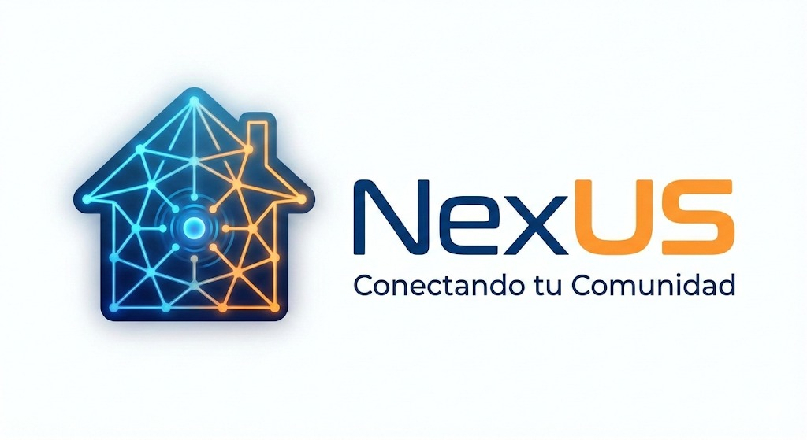

<table width="100%" style="border: none; background: none;">
  <tr>
    <td align="center" width="50%" style="border: none;">
      
    </td>
    <td align="center" width="50%" style="border: none;">
      
    </td>
  </tr>
</table>

<h1>Plan de Usuarios Piloto – NexUS</h1>

  
  
  
  

  <strong>Plataforma integral de gestión y convivencia para residencias universitarias.</strong>
   
  Universidad de Sevilla - Curso 2025/2026

---

## Historial de Versiones

| Versión | Fecha       | Cambio principal                                                                 |
|---------|-------------|----------------------------------------------------------------------------------|
| 1.0.0   | 09/02/2026  | Creación del documento base y estilos                                            |
| 1.1.0   | 10/02/2026  | Añadidos apartados 3 y 4                                                         |
| 1.1.1   | 10/02/2026  | Añadidos apartados 1, 2 y 5                                                        |

---

## Índice

1. [Definición de perfiles piloto](#1-definición-de-perfiles-piloto)
2. [Estrategias de identificación y captación](#2-estrategias-de-identificación-y-captación)
3. [Estrategia de relación y gestión con los usuarios piloto](#3-estrategia-de-relación-y-gestión-con-los-usuarios-piloto)
4. [Modelo de gestión y relación con usuarios piloto](#4-modelo-de-gestión-y-relación-con-usuarios-piloto)
5. [Incentivos y beneficios para usuarios piloto](#5-incentivos-y-beneficios-para-usuarios-piloto)

---

## 1. Definición de perfiles piloto
Los usuarios piloto pueden ser las residencias privadas, colegios mayores y empresas gestoras de residencias de estudiantes, ya que son quienes sufren actualmente la fragmentación de procesos con herramientas como Excel o WhatsApp. Estos centros buscan profesionalizar sus operaciones sin la rigidez de un ERP tradicional. Asimismo, incluiremos en el piloto a perfiles especializados externos (expertos en el sector, estudiantes o usuarios avanzados) que puedan evaluar de forma integral la experiencia de cada tipo de usuario final de la app (como el estudiante, el cocinero o el administrador) asegurando que la experiencia sea intuitiva, completa y valiosa para todos los roles involucrados en el día a día de la residencia.

- **Residencias privadas independientes:** Este perfil corresponde a centros de tamaño medio que operan actualmente bajo una "gestión fragmentada" basada en hojas de cálculo y llamadas telefónicas. Al participar como usuarios piloto, estos centros validarán cómo una plataforma específica para el día a día puede sustituir herramientas improvisadas, eliminando ineficiencias y la sobrecarga de trabajo para el personal gestor. Su objetivo principal será profesionalizar los procesos internos.

- **Empresas gestoras de residencias de estudiantes:** Las compañías que administran diversos edificios necesitan una visión global de la ocupación y las incidencias. Como usuarios piloto, estas empresas permitirán testear la plataforma, así como la capacidad de escalar el sistema según el número de estudiantes. Además, son los candidatos ideales para probar el módulo de marca blanca, personalizando la plataforma con su identidad corporativa para ofrecer una imagen más profesional.

- **Colegios mayores y fundaciones universitarias:** Dado que estas instituciones priorizan el bienestar y la vida estudiantil, su participación es fundamental para validar la diferencia clave del proyecto: la vida social integrada. Estos centros utilizarán los canales temáticos moderados, la organización de eventos y las inscripciones a actividades para demostrar que el sistema no solo gestiona infraestructura, sino que optimiza la convivencia.

- **Residencias con problemas de comunicación interna:** Este grupo corresponde a centros que aún dependen de números de teléfono personales o grupos de WhatsApp, lo que genera caos informativo. Como usuarios pilotos, se centrarán en implementar el sistema de avisos oficiales con confirmación de lectura y el check-in y firma de normas digital. Su validación servirá para demostrar cómo una plataforma única puede eliminar la dependencia de herramientas externas no profesionales.

---

## 2. Estrategias de identificación y captación
**Venta Directa**

Esta táctica consiste en identificar residencias privadas independientes que aún gestionan su día a día de forma manual. Al buscar centros que dependen de herramientas como WhatsApp, hojas de cálculo o correos electrónicos, podemos ofrecer la plataforma como la solución definitiva para profesionalizar sus procesos internos y reducir la carga de trabajo. El objetivo es presentar nuestro sistema como una herramienta específica para el día a día que sustituye múltiples aplicaciones ineficientes por una sola plataforma moderna y accesible.

**Alianza con asociaciones**

Esta estrategia consiste en presentar la plataforma a entidades que agrupan múltiples residencias individuales, colegios mayores o fundaciones universitarias. Al proponer el sistema a una asociación, se busca que esta actúe como puente para llegar de golpe a varios clientes potenciales que comparten el mismo problema: la gestión fragmentada con Excel o WhatsApp. Se les ofrece como una solución intuitiva que automatiza el día a día sin complejidad técnica.

**Socio Colaborador**

Esta estrategia busca atraer a directores ofreciéndoles ser parte del desarrollo inicial del software. Se les propone probar los módulos básicos —como la gestión de habitaciones, incidencias y reservas— a cambio de adaptar la plataforma a sus necesidades operativas reales. Para incentivar su participación, se pueden ofrecer beneficios futuros como el módulo de la marca blanca.

**Estudiantes Embajadores**

Dado que los estudiantes residentes son los usuarios finales que más sufren la mala experiencia de gestión, esta táctica utiliza su influencia. Se busca a estudiantes que valoren la "vida social y convivencia" para que muestren a sus gestores cómo la app facilitaría el check-in digital, la inscripción a eventos y la comunicación sin usar números de teléfono. Al demostrar que los residentes prefieren una UX moderna sobre los sistemas antiguos de la competencia, se genera una presión positiva para que la residencia adopte el usuario piloto.

**Concienciación**

Consiste en atraer a los directores mostrándoles los riesgos reales de seguir usando herramientas como WhatsApp o Excel, como la pérdida de datos o la falta de privacidad. Se busca generar una reflexión en el gestor sobre cómo estas "soluciones improvisadas" están dañando su eficiencia y la convivencia de los estudiantes. Al educarlos sobre el problema, la plataforma se presenta no solo como una opción, sino como una necesidad urgente para profesionalizar la residencia.

---

## 3. Estrategia de relación y gestión con los usuarios piloto
Nuestra relación con los usuarios se basará en un modelo de éxito compartido y mejora continua, garantizando eficiencia y coherencia.

**Enfoque cercano y consultivo**

No vender solo software, sino una solución a sus problemas diarios. Nuestro responsable tendrá como objetivo entender los flujos de trabajo actuales (WhatsApp, Excel, manuales) y demostrarles cómo nuestra plataforma los simplificaría, convirtiendo sus problemas operativos en oportunidades de mejora.

**Estrategia de relación centralizada**

El gestor de usuarios pilotos será el punto de contacto principal, asegurando una comunicación unificada y evitando la dispersión de información relevante. La comunicación se organizará desde el día uno siguiendo un plan de contacto.

**Sesiones de onboarding personalizadas**

Documentación estructurada, videotutoriales breves por roles y plantillas para facilitar el despliegue inicial de prueba. Se realizarán sesiones programadas para diferentes perfiles (administradores, personal de mantenimiento, coordinadores, cocineros).

**Feedback continuo**

Reuniones semanales o quincenales para recoger necesidades, problemas y sugerencias de mejora. Obtendremos feedback proveniente de reuniones, encuestas y comunicación directa. Las _primeras reuniones_ analizarán el feedback inicial de usabilidad, las _intermedias_ evaluarán las funcionalidades básicas y las _finales_ comprobarán la satisfacción general y el impacto operativo. Contaremos con reuniones de seguimiento programadas individuales con los usuarios de prueba.

**Gestión de expectativas y compromisos**

Se aceptará un acuerdo de colaboración para el usuario piloto, que actuará como guía, recogiendo la duración del período, el alcance de las funcionalidades incluidas y los compromisos de ambas partes.
- _Nuestros compromisos_: Horario de soporte, tiempo máximo de respuesta para incidencias, y la implementación de mejoras acordadas.
- _Sus compromisos_: Designar un encargado en caso de empresas gestoras o residencias, participar en al menos el 75% de las sesiones y usar la plataforma.

---

## 4. Modelo de gestión y relación con usuarios piloto
**Acuerdo de confidencialidad y colaboración:** Un documento estandarizado que actuará como contrato base con todas los usuarios piloto. Este acuerdo especificará:
- _Duración de la prueba piloto_: el periodo definido del piloto (ej. 3 meses) y las funcionalidades específicas incluidas.
- _Compromisos recíprocos_: nuestras obligaciones de soporte y sus obligaciones de participación y de feedback.
- _Propiedad_: quedará claro que el software y sus mejoras derivadas son de nuestra propiedad.

**Anexo de protección de datos:** Anexo legal vinculado al acuerdo anterior, que confirmará el cumplimiento del RGPD.
- _Roles_: La residencia es la responsable del Tratamiento de datos de los estudiantes y personal. Nuestra empresa actuará como “Encargada de ese tratamiento de datos” según el RGPD.
- _Finalidad y Confidencialidad_: Los datos se procesarán únicamente para la prestación del servicio durante las pruebas y con total confidencialidad (o anonimato).
- _Medidas de seguridad_: Medidas técnicas y organizativas que implementaremos para la protección de esos datos.
- _Plan de destrucción de datos_: Protocolo acordado para la eliminación segura de todos los datos al finalizar las pruebas si no hubiese continuidad.

**Estrategia de datos flexible:**
- _Datos reales_: Para residencias que lo autoricen, migraremos sus datos reales (estudiantes, habitaciones, personal) al entorno piloto.
- _Datos sintéticos_: Ofreceremos la posibilidad de comenzar con un conjunto de datos anónimos y ficticios generados por nosotros. Esto permite a la residencia conocer y explorar la plataforma con total seguridad antes de decidir cargar información real.

**Gestión estricta de roles y permisos:** Configuraremos los perfiles de acceso. Para que cada perfil tenga acceso estrictamente a lo que le corresponde, por ejemplo, _administrador de la residencia_ (acceso total a la configuración y datos de su centro), _personal operativo_ (acceso a módulos como incidencias, reservas, comunicación) y usuario _Estudiante_ (pruebas de funcionalidades como residente).

**Sistema de reportes y mejora continua:** El feedback será procesado, priorizado y convertido en acción.
- Registraremos todo el feedback recibido en una herramienta (email, formularios…) y nuestro equipo ***revisará***, ***etiquetará*** (Bugs, mejoras, nuevas funcionalidades) y ***priorizará*** (alta, media, baja) según impacto y frecuencia.
- Se notificará a los usuarios piloto que la sugerencia o reporte ha sido aceptada y que se programa para la versión X de entrega.
- Documentaremos todas las decisiones de diseño o desarrollo tomadas como resultado del feedback piloto, esto servirá como material para el equipo de ventas y marketing final (“Implementamos X funcionalidad porque 5 residencias o estudiantes nos mostraron la necesidad de tenerla”).
---

## 5. Incentivos y beneficios para usuarios piloto
**Acceso gratuito y preferencial**

El principal incentivo para los usuarios piloto es el uso de la plataforma sin coste alguno durante toda la fase de pruebas, permitiéndoles profesionalizar su gestión sin inversión inicial. Además, al ser los primeros, tendrán prioridad para solicitar pequeños ajustes en las funciones de día a día, como la gestión de habitaciones o el sistema de incidencias, asegurando que la herramienta se adapte perfectamente a su forma de trabajar.

**Identidad corporativa y marca blanca**

Uno de los beneficios más atractivos es la posibilidad de utilizar la función de marca blanca desde el inicio. Esto permite que la residencia ofrezca a sus estudiantes una aplicación que muestra su propio logo y colores corporativos, lo que mejora su imagen profesional y les ayuda a diferenciarse de otros centros que aún usan métodos anticuados como WhatsApp o Excel.

**Soporte y formación prioritaria**

Al participar en el usuario piloto, la residencia contará con un acompañamiento directo y personalizado para configurar el sistema y formar a su personal (recepción, mantenimiento y dirección). Esto garantiza que el cambio digital sea suave y sin errores, asegurando que el check-in digital de los estudiantes sea un éxito desde el primer día.

---